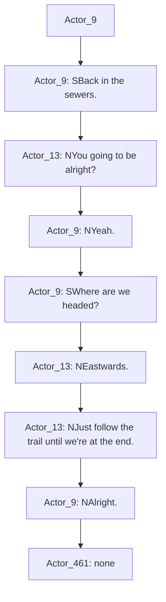

# Trachi/Central/Rondham Central/Sewers (Safehouse)/EV002

```mermaid
graph TD
    597_0["Actor_9"]
    597_1["Actor_9: SBack in the sewers."]
    597_2["Actor_13: NYou going to be alright?"]
    597_3["Actor_9: NYeah."]
    597_4["Actor_9: SWhere are we headed?"]
    597_5["Actor_13: NEastwards."]
    597_6["Actor_13: NJust follow the trail until we're at the end."]
    597_7["Actor_9: NAlright."]
    597_8["Actor_461: none"]
    597_0 --> 597_1
    597_1 --> 597_2
    597_2 --> 597_3
    597_3 --> 597_4
    597_4 --> 597_5
    597_5 --> 597_6
    597_6 --> 597_7
    597_7 --> 597_8
```