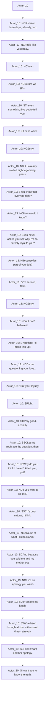

# Trachi/Central/Rondham Central/Sewers (Safehouse)/Sewers (Boat)/EV001

```mermaid
graph TD
    600_0["Actor_10"]
    600_1["Actor_10: NCIt's been three days, already, hm."]
    600_2["Actor_13: NCFeels like yesterday."]
    600_3["Actor_10: NCYeah."]
    600_4["Actor_10: NCBefore we go..."]
    600_5["Actor_10: SThere's something I've got to tell you."]
    600_6["Actor_13: NIt can't wait?"]
    600_7["Actor_10: NCSorry."]
    600_8["Actor_10: NBut I already waited eight agonizing years."]
    600_9["Actor_10: SYou know that I love you, right?"]
    600_10["Actor_13: NCHow would I know?"]
    600_11["Actor_10: SYou never asked yourself why I'm so fiercely loyal to you?"]
    600_12["Actor_13: NBecause it's part of your job?"]
    600_13["Actor_10: SI'm serious, Atlas."]
    600_14["Actor_13: NCSorry."]
    600_15["Actor_13: NBut I don't believe it."]
    600_16["Actor_10: SYou think I'd make this up?"]
    600_17["Actor_13: NCI'm not questioning your love..."]
    600_18["Actor_13: NBut your loyalty."]
    600_19["Actor_10: SRight."]
    600_20["Actor_10: SCVery good, actually."]
    600_21["Actor_10: SSCLet me rephrase the question, then."]
    600_22["Actor_10: NSWhy do you think I haven't killed you, yet?"]
    600_23["Actor_13: NDo you want to kill me?"]
    600_24["Actor_10: SSCIt's only natural, I think."]
    600_25["Actor_13: NBecause of what I did to Daniil?"]
    600_26["Actor_10: SCAnd because you sold me and my mother out."]
    600_27["Actor_13: NCIf it's an apology you want-"]
    600_28["Actor_10: SDon't make me laugh."]
    600_29["Actor_10: SWe've been through all that a thousand times, already."]
    600_30["Actor_10: SCI don't want another apology."]
    600_31["Actor_10: SI want you to know the truth."]
    600_0 --> 600_1
    600_1 --> 600_2
    600_2 --> 600_3
    600_3 --> 600_4
    600_4 --> 600_5
    600_5 --> 600_6
    600_6 --> 600_7
    600_7 --> 600_8
    600_8 --> 600_9
    600_9 --> 600_10
    600_10 --> 600_11
    600_11 --> 600_12
    600_12 --> 600_13
    600_13 --> 600_14
    600_14 --> 600_15
    600_15 --> 600_16
    600_16 --> 600_17
    600_17 --> 600_18
    600_18 --> 600_19
    600_19 --> 600_20
    600_20 --> 600_21
    600_21 --> 600_22
    600_22 --> 600_23
    600_23 --> 600_24
    600_24 --> 600_25
    600_25 --> 600_26
    600_26 --> 600_27
    600_27 --> 600_28
    600_28 --> 600_29
    600_29 --> 600_30
    600_30 --> 600_31
```