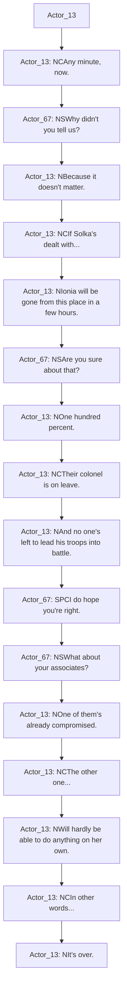

# Trachi/Central/Rondham Central/Sewers (Safehouse)/Sewers (Hudsman Corner)/EV002

```mermaid
graph TD
    603_0["Actor_13"]
    603_1["Actor_13: NCAny minute, now."]
    603_2["Actor_67: NSWhy didn't you tell us?"]
    603_3["Actor_13: NBecause it doesn't matter."]
    603_4["Actor_13: NCIf Solka's dealt with..."]
    603_5["Actor_13: NIonia will be gone from this place in a few hours."]
    603_6["Actor_67: NSAre you sure about that?"]
    603_7["Actor_13: NOne hundred percent."]
    603_8["Actor_13: NCTheir colonel is on leave."]
    603_9["Actor_13: NAnd no one's left to lead his troops into battle."]
    603_10["Actor_67: SPCI do hope you're right."]
    603_11["Actor_67: NSWhat about your associates?"]
    603_12["Actor_13: NOne of them's already compromised."]
    603_13["Actor_13: NCThe other one..."]
    603_14["Actor_13: NWill hardly be able to do anything on her own."]
    603_15["Actor_13: NCIn other words..."]
    603_16["Actor_13: NIt's over."]
    603_0 --> 603_1
    603_1 --> 603_2
    603_2 --> 603_3
    603_3 --> 603_4
    603_4 --> 603_5
    603_5 --> 603_6
    603_6 --> 603_7
    603_7 --> 603_8
    603_8 --> 603_9
    603_9 --> 603_10
    603_10 --> 603_11
    603_11 --> 603_12
    603_12 --> 603_13
    603_13 --> 603_14
    603_14 --> 603_15
    603_15 --> 603_16
```