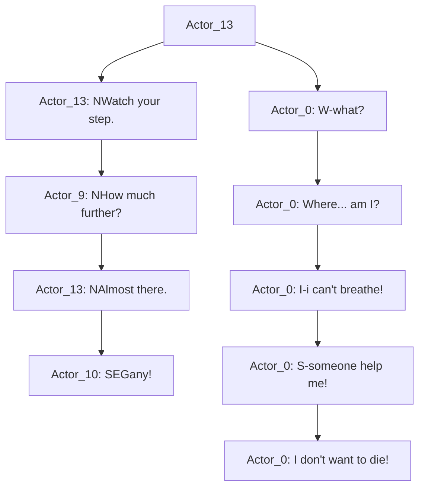

# Trachi/Central/Rondham Central/Sewers (Safehouse)/Sewers (Pike Bridge)/EV004

```mermaid
graph TD
    604_0["Actor_13"]
    604_1["Actor_13: NWatch your step."]
    604_2["Actor_9: NHow much further?"]
    604_3["Actor_13: NAlmost there."]
    604_4["Actor_10: SEGany!"]
    604_5["Actor_0: W-what?"]
    604_6["Actor_0: Where... am I?"]
    604_7["Actor_0: I-i can't breathe!"]
    604_8["Actor_0: S-someone help me!"]
    604_9["Actor_0: I don't want to die!"]
    604_0 --> 604_1
    604_0 --> 604_5
    604_1 --> 604_2
    604_2 --> 604_3
    604_3 --> 604_4
    604_5 --> 604_6
    604_6 --> 604_7
    604_7 --> 604_8
    604_8 --> 604_9
```