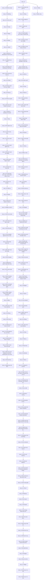

# Trachi/Central/Rondham Central/Sewers (Safehouse)/Sewers (Room)/Atlas

```mermaid
graph TD
    608_0["Actor_13"]
    608_1["Actor_13: NWhat's wrong?"]
    608_2["Actor_9: NCNothing."]
    608_3["Actor_13: NCYou sure?"]
    608_4["Actor_9: NCYeah."]
    608_5["Actor_13: NOkay."]
    608_6["Actor_9: SCAtlas..."]
    608_7["Actor_13: NYeah?"]
    608_8["Actor_9: RPAre you absolutely sure this'll work?"]
    608_9["Actor_13: NWhat do you mean?"]
    608_10["Actor_9: RCHolding onto something for that long..."]
    608_11["Actor_9: RYou know how they are."]
    608_12["Actor_13: NCYeah."]
    608_13["Actor_13: NCIf you want me to go, instead..."]
    608_14["Actor_13: NI'll do it."]
    608_15["Actor_9: SCThat's no good."]
    608_16["Actor_9: SPCYour boss wouldn't let you go."]
    608_17["Actor_9: SPNot for anything in the world."]
    608_18["Actor_9: RCNo."]
    608_19["Actor_9: RIt's gotta be me."]
    608_20["Actor_13: NCI'm sorry, Gany."]
    608_21["Actor_13: NCIf you want out..."]
    608_22["Actor_13: NI won't hold it against you."]
    608_23["Actor_9: RPCDon't mock me, please."]
    608_24["Actor_9: RPI'd never forgive myself."]
    608_25["Actor_9: SPCAnd you know that."]
    608_26["Actor_13: NI wish there was a way I could make it easier on you."]
    608_27["Actor_9: NCYou can, actually..."]
    608_28["Actor_13: NTell me."]
    608_29["Actor_9: SCWell..."]
    608_30["Actor_9: SGive me a reason to hold out."]
    608_31["Actor_9: SPMake it worth it."]
    608_32["Actor_13: NCI'll try my best."]
    608_33["Actor_9: SPCThat's not what I mean."]
    608_34["Actor_9: SCAt this point..."]
    608_35["Actor_9: SYou probably figured out how I work."]
    608_36["Actor_9: SPAnd what drives me."]
    608_37["Actor_9: RPCI fall in love with things."]
    608_38["Actor_9: SPCOr people."]
    608_39["Actor_9: RPBecause I want to make them mine."]
    608_40["Actor_9: RCI cannot resist it."]
    608_41["Actor_9: RAnd I'll always be a victim to these feelings."]
    608_42["Actor_9: RPCI've thought about it time and time again."]
    608_43["Actor_9: RPBut I always end up at the same conclusion."]
    608_44["Actor_9: RAtlas..."]
    608_45["Actor_9: RPI'll have to fall in love with you."]
    608_46["Actor_13: NCGany..."]
    608_47["Actor_9: RPCI know."]
    608_48["Actor_13: NWhat do you want me to do?"]
    608_49["Actor_9: SI was briefed on you, you know..."]
    608_50["Actor_9: SCNot the full story, of course."]
    608_51["Actor_9: RCBut I know there was a girl."]
    608_52["Actor_9: RShe was more important to you than anything else in the world."]
    608_53["Actor_9: NCSo tell me..."]
    608_54["Actor_9: NSWhat was she like?"]
    608_55["Actor_13: NCAnd that's the gist of it."]
    608_56["Actor_9: NCOkay."]
    608_57["Actor_9: NThat explains a lot."]
    608_58["Actor_9: SCBut to be frank..."]
    608_59["Actor_9: SI didn't expect you to have a side like this."]
    608_60["Actor_13: NSorry to burst your bubble."]
    608_61["Actor_13: NCBut I'm only human, after all."]
    608_62["Actor_9: NCDon't worry about it."]
    608_63["Actor_9: NSI think it's adorable in some way."]
    608_64["Actor_9: RGAnd I can definitely emphasize with it."]
    608_65["Actor_9: NSIt'll do."]
    608_66["Actor_13: NIs that a yes?"]
    608_67["Actor_9: NCYup."]
    608_68["Actor_9: NSI'll try!"]
    608_69["Actor_9: SCNo promises, though."]
    608_70["Actor_9: SThe moment shit hits the fan-"]
    608_71["Actor_13: NYou'll give them Fero."]
    608_72["Actor_9: SAnd if that doesn't help?"]
    608_73["Actor_13: NYou'll tell them about Hermingrad."]
    608_74["Actor_9: NCGood."]
    608_75["Actor_13: NAs for the other thing..."]
    608_76["Actor_9: NCSorry."]
    608_77["Actor_9: NSBut I insist."]
    608_78["Actor_13: NWhy do you care about her in the first place?"]
    608_79["Actor_9: NCIf you were in my spot..."]
    608_80["Actor_9: NSWouldn't you want the same?"]
    608_81["Actor_13: NCThat's different."]
    608_82["Actor_9: NSI don't think so."]
    608_83["Actor_9: NCAs far as I can see it..."]
    608_84["Actor_9: NSIt's what she does."]
    608_85["Actor_13: NCMaybe."]
    608_86["Actor_13: NCOr maybe you just want to keep things pretty..."]
    608_87["Actor_13: NBefore you smash them to bits."]
    608_88["Actor_9: RGCYou're really something else, Atlas."]
    608_89["Actor_9: RPCIt's like you're incredibly clever..."]
    608_90["Actor_9: RGCBut also insurmountably stupid, at the same time."]
    608_91["Actor_9: RGOr 'maybe' it's just me not seeing you straight."]
    608_92["Actor_9: SGCIn any case."]
    608_93["Actor_9: SGYou're in it for the madness."]
    608_94["Actor_9: SGCWhether you like it, or not."]
    608_95["Actor_9: RGCThere's something special about being in control."]
    608_96["Actor_9: RGRight?"]
    608_97["Actor_13: NCHm."]
    608_98["Actor_13: NIt's working?"]
    608_99["Actor_9: NCSomewhat, yeah."]
    608_100["Actor_9: NSBut I think I'm getting there."]
    608_101["Actor_13: NCOkay."]
    608_102["Actor_13: NIt's about time I got underway."]
    608_103["Actor_9: NCYeah."]
    608_104["Actor_9: NMe too."]
    608_105["Actor_13: NGood luck."]
    608_106["Actor_9: NCLikewise."]
    608_107["Actor_9: SGÁron."]
    608_108["Actor_13: NCSpeak for yourself."]
    608_109["Actor_13: NBut I for one don't give a shit about who you are."]
    608_110["Actor_13: NCBecause the only thing I see in front of me..."]
    608_111["Actor_13: NIs a child."]
    608_112["Actor_9: SGCKeep it coming."]
    608_113["Actor_13: SCEverywhere you go..."]
    608_114["Actor_13: SYou need to be center of attention."]
    608_115["Actor_13: NA life directed towards submission."]
    608_116["Actor_13: NCBut never the happy servant for very long."]
    608_117["Actor_13: NAnd so you drag yourself from high to low..."]
    608_118["Actor_13: NCHoping to find something."]
    608_119["Actor_13: SCOr someone."]
    608_120["Actor_13: STo latch onto forever."]
    608_121["Actor_13: SCIt's your sickness."]
    608_122["Actor_13: SAnd your addiction."]
    608_123["Actor_13: SPCIf it weren't for someone pulling your strings..."]
    608_124["Actor_13: SPYou'd have no idea where to go."]
    608_125["Actor_13: SCIsn't that right?"]
    608_126["Actor_13: STimo?"]
    608_127["Actor_9: RGCBravo."]
    608_128["Actor_9: RGI mean it."]
    608_129["Actor_9: SGThanks!"]
    608_130["Actor_13: NFor being honest with you?"]
    608_131["Actor_9: SGCYou know what..."]
    608_132["Actor_9: SGOne day I'll kill you."]
    608_133["Actor_13: SFeel free to try."]
    608_134["Actor_13: SPCBut for now..."]
    608_135["Actor_13: SPIt's mutual assured destruction."]
    608_136["Actor_9: SGCSolid finish."]
    608_137["Actor_9: NCAlright."]
    608_138["Actor_9: NSLet's do this."]
    608_139["Actor_13: NRight."]
    608_140["Actor_13: NCSee you in a few."]
    608_141["Actor_9: NCSee you in a few."]
    608_142["Actor_9: SCMan..."]
    608_143["Actor_9: SWhat a day."]
    608_0 --> 608_1
    608_0 --> 608_55
    608_0 --> 608_142
    608_1 --> 608_2
    608_2 --> 608_3
    608_3 --> 608_4
    608_4 --> 608_5
    608_5 --> 608_6
    608_6 --> 608_7
    608_7 --> 608_8
    608_8 --> 608_9
    608_9 --> 608_10
    608_10 --> 608_11
    608_11 --> 608_12
    608_12 --> 608_13
    608_13 --> 608_14
    608_14 --> 608_15
    608_15 --> 608_16
    608_16 --> 608_17
    608_17 --> 608_18
    608_18 --> 608_19
    608_19 --> 608_20
    608_20 --> 608_21
    608_21 --> 608_22
    608_22 --> 608_23
    608_23 --> 608_24
    608_24 --> 608_25
    608_25 --> 608_26
    608_26 --> 608_27
    608_27 --> 608_28
    608_28 --> 608_29
    608_29 --> 608_30
    608_30 --> 608_31
    608_31 --> 608_32
    608_32 --> 608_33
    608_33 --> 608_34
    608_34 --> 608_35
    608_35 --> 608_36
    608_36 --> 608_37
    608_37 --> 608_38
    608_38 --> 608_39
    608_39 --> 608_40
    608_40 --> 608_41
    608_41 --> 608_42
    608_42 --> 608_43
    608_43 --> 608_44
    608_44 --> 608_45
    608_45 --> 608_46
    608_46 --> 608_47
    608_47 --> 608_48
    608_48 --> 608_49
    608_49 --> 608_50
    608_50 --> 608_51
    608_51 --> 608_52
    608_52 --> 608_53
    608_53 --> 608_54
    608_55 --> 608_56
    608_56 --> 608_57
    608_57 --> 608_58
    608_58 --> 608_59
    608_59 --> 608_60
    608_60 --> 608_61
    608_61 --> 608_62
    608_62 --> 608_63
    608_63 --> 608_64
    608_64 --> 608_65
    608_65 --> 608_66
    608_66 --> 608_67
    608_67 --> 608_68
    608_68 --> 608_69
    608_69 --> 608_70
    608_70 --> 608_71
    608_71 --> 608_72
    608_72 --> 608_73
    608_73 --> 608_74
    608_74 --> 608_75
    608_75 --> 608_76
    608_76 --> 608_77
    608_77 --> 608_78
    608_78 --> 608_79
    608_79 --> 608_80
    608_80 --> 608_81
    608_81 --> 608_82
    608_82 --> 608_83
    608_83 --> 608_84
    608_84 --> 608_85
    608_85 --> 608_86
    608_86 --> 608_87
    608_87 --> 608_88
    608_88 --> 608_89
    608_89 --> 608_90
    608_90 --> 608_91
    608_91 --> 608_92
    608_92 --> 608_93
    608_93 --> 608_94
    608_94 --> 608_95
    608_95 --> 608_96
    608_96 --> 608_97
    608_97 --> 608_98
    608_98 --> 608_99
    608_99 --> 608_100
    608_100 --> 608_101
    608_101 --> 608_102
    608_102 --> 608_103
    608_103 --> 608_104
    608_104 --> 608_105
    608_105 --> 608_106
    608_106 --> 608_107
    608_107 --> 608_108
    608_108 --> 608_109
    608_109 --> 608_110
    608_110 --> 608_111
    608_111 --> 608_112
    608_112 --> 608_113
    608_113 --> 608_114
    608_114 --> 608_115
    608_115 --> 608_116
    608_116 --> 608_117
    608_117 --> 608_118
    608_118 --> 608_119
    608_119 --> 608_120
    608_120 --> 608_121
    608_121 --> 608_122
    608_122 --> 608_123
    608_123 --> 608_124
    608_124 --> 608_125
    608_125 --> 608_126
    608_126 --> 608_127
    608_127 --> 608_128
    608_128 --> 608_129
    608_129 --> 608_130
    608_130 --> 608_131
    608_131 --> 608_132
    608_132 --> 608_133
    608_133 --> 608_134
    608_134 --> 608_135
    608_135 --> 608_136
    608_136 --> 608_137
    608_137 --> 608_138
    608_138 --> 608_139
    608_139 --> 608_140
    608_140 --> 608_141
    608_142 --> 608_143
```