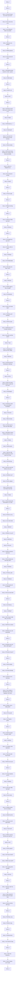

# Trachi/Central/Stuart Alley/GooseShed/HQ 1

```mermaid
graph TD
    8_0["Actor_4"]
    8_1["Actor_4"]
    8_2["Actor_4: SCCan this guy be on time, just once?"]
    8_3["Actor_6: SYou know how he is."]
    8_4["Actor_4: pic=16Doesn't make it any better."]
    8_5["Actor_4"]
    8_6["Actor_4: What are you reading?"]
    8_7["Actor_6: Nothing special."]
    8_8["Actor_6: SJust some old novel."]
    8_9["Actor_6"]
    8_10["Actor_4: NPCBeats pacing around in circles, I guess."]
    8_11["Actor_6: NGDIt does!"]
    8_12["Actor_6"]
    8_13["Actor_4: NSCYo, Ari."]
    8_14["Actor_6: Hm?"]
    8_15["Actor_6"]
    8_16["Actor_4: NSI bet he won't show up for another hour or so."]
    8_17["Actor_6: Okay?"]
    8_18["Actor_4: NGShould we... ?"]
    8_19["Actor_6: SSeriously?"]
    8_20["Actor_6: You know he's gonna arrive the exact moment-"]
    8_21["Actor_4: SCEven better."]
    8_22["Actor_4: SPCIf we're lucky, it'll teach him a thing or two about punctuality."]
    8_23["Actor_4"]
    8_24["Actor_6: SSorry to disappoint you."]
    8_25["Actor_6: But someone's coming."]
    8_26["Actor_4: SHuh?"]
    8_27["Actor_4"]
    8_28["Actor_4: SYou're right."]
    8_29["Actor_4"]
    8_30["Actor_4: SPAbout fucking tim-"]
    8_31["Actor_4"]
    8_32["Actor_5: NSCHm? What was that?"]
    8_33["Actor_4: RCSorry."]
    8_34["Actor_4"]
    8_35["Actor_4: RI thought you were him."]
    8_36["Actor_5: NCHe's still not here?"]
    8_37["Actor_4: RCNope."]
    8_38["Actor_5: NCUnbelievable."]
    8_39["Actor_6: How have you been, Eury?"]
    8_40["Actor_6"]
    8_41["Actor_5: NSCAri!"]
    8_42["Actor_5: NGDSo glad to see you again!"]
    8_43["Actor_6: SSLikewise!"]
    8_44["Actor_6"]
    8_45["Actor_6: How's Kris these days?"]
    8_46["Actor_5: NSCBusy and brooding."]
    8_48["Actor_5: NSThe usual."]
    8_49["Actor_6: RSReminds me of a certain someone."]
    8_50["Actor_5: pic=6He's still the same?"]
    8_51["Actor_6: Yup!"]
    8_52["Actor_6: SHardly get a word out of him, lately."]
    8_53["Actor_5: NSCHm."]
    8_54["Actor_5: NSCSounds like everything's underway."]
    8_55["Actor_5"]
    8_56["Actor_4: SCYo."]
    8_57["Actor_4: SDon't you guys think it's better to wait until he's here?"]
    8_58["Actor_5: NSCReally?"]
    8_59["Actor_5"]
    8_60["Actor_5: NSCSince when do you care about formalities?"]
    8_61["Actor_4: SCI don't."]
    8_62["Actor_4: SBut he does."]
    8_63["Actor_4: SCHe'll want to hear every little detail."]
    8_64["Actor_4: SPCWhich means I'll have to listen to it, too."]
    8_65["Actor_4: STwice."]
    8_66["Actor_5: NSFair point."]
    8_67["Actor_5: NSCLet's talk about something you don't want him to hear."]
    8_68["Actor_4: NPCOh boy."]
    8_69["Actor_5: NSCYou know his brother, don't you?"]
    8_70["Actor_4: NCWhich one?"]
    8_71["Actor_5: RCOh, please!"]
    8_72["Actor_5: RYou can do much better than that!"]
    8_73["Actor_4: SYeah."]
    8_74["Actor_4: SCNot having this conversation, for a start."]
    8_75["Actor_4"]
    8_76["Actor_6: SCome on, Iky."]
    8_77["Actor_6: Just a few hints!"]
    8_78["Actor_4: SWHuh?"]
    8_79["Actor_4: SWhat's it to you?"]
    8_80["Actor_6: NSCSorry."]
    8_81["Actor_6: SI'm just..."]
    8_82["Actor_6: NSDSo excited to meet him!"]
    8_83["Actor_4: SCHow about you ask Greg, then?"]
    8_84["Actor_5: NCAhem."]
    8_85["Actor_4: SCYeah, yeah."]
    8_86["Actor_4: S'Orpheus'."]
    8_87["Actor_6: SHe'll barely tell us anything."]
    8_88["Actor_6"]
    8_89["Actor_5: pic=6Icarus..."]
    8_90["Actor_4: NCWhat?"]
    8_91["Actor_5: NSCI heard a little story, you know."]
    8_92["Actor_5: NSCFrom a friend."]
    8_93["Actor_5: NSAbout you and Ganymede."]
    8_94["Actor_5: RCWhat was your place called again?"]
    8_95["Actor_5"]
    8_96["Actor_5: R'Chicken House'?"]
    8_97["Actor_5"]
    8_98["Actor_4: NCGo ahead."]
    8_99["Actor_4: Ari knows already."]
    8_100["Actor_4: NCAnd so do I, obviously."]
    8_101["Actor_4"]
    8_102["Actor_4: SYou might as well tell the story to that cupboard, over there."]
    8_103["Actor_4"]
    8_104["Actor_5: RCMy, you've really grown!"]
    8_105["Actor_5: RI'm proud!"]
    8_106["Actor_4: SCThanks, I guess."]
    8_107["Actor_4"]
    8_108["Actor_5: NSCHow about we make a deal?"]
    8_109["Actor_4: NCEury."]
    8_110["Actor_4: It's bribery, then blackmail."]
    8_111["Actor_4: SNot the other way around."]
    8_112["Actor_5: NSCIf you say so."]
    8_113["Actor_5"]
    8_114["Actor_6: It's about Daphne, isn't it?"]
    8_115["Actor_5: NCMhm."]
    8_116["Actor_6: SCIs she really that bad?"]
    8_117["Actor_5: Even worse."]
    8_118["Actor_5"]
    8_119["Actor_5: NSCBut unless one of us breaks..."]
    8_120["Actor_5: NSWe'll be fine!"]
    8_121["Actor_4: NCAre you sure about that?"]
    8_122["Actor_5: You're not?"]
    8_123["Actor_4: SWhen was the last time you saw her?"]
    8_124["Actor_5: Hm?"]
    8_125["Actor_4: SCTwo years?"]
    8_126["Actor_4: SOr was it three?"]
    8_127["Actor_5: What's your point?"]
    8_128["Actor_4: SI'm saying she's changed."]
    8_129["Actor_4: SCA lot."]
    8_130["Actor_4"]
    8_131["Actor_4: SCIf you want my opinion..."]
    8_132["Actor_4: SWe should kill her the moment she gets here."]
    8_133["Actor_4: SCHer and that other guy."]
    8_134["Actor_4"]
    8_135["Actor_5: RGCNow, now."]
    8_136["Actor_5: RGDon't stop."]
    8_137["Actor_5"]
    8_138["Actor_4: NCNevermind."]
    8_139["Actor_4: Let's wait for Greg."]
    8_140["Actor_4"]
    8_141["Actor_4: NCIn the meantime..."]
    8_142["Actor_4: Here's hoping you're right."]
    8_143["Actor_4"]
    8_144["Actor_6: And you know that!"]
    8_0 --> 8_1
    8_1 --> 8_2
    8_2 --> 8_3
    8_3 --> 8_4
    8_4 --> 8_5
    8_5 --> 8_6
    8_6 --> 8_7
    8_7 --> 8_8
    8_8 --> 8_9
    8_9 --> 8_10
    8_10 --> 8_11
    8_11 --> 8_12
    8_12 --> 8_13
    8_13 --> 8_14
    8_14 --> 8_15
    8_15 --> 8_16
    8_16 --> 8_17
    8_17 --> 8_18
    8_18 --> 8_19
    8_19 --> 8_20
    8_20 --> 8_21
    8_21 --> 8_22
    8_22 --> 8_23
    8_23 --> 8_24
    8_24 --> 8_25
    8_25 --> 8_26
    8_26 --> 8_27
    8_27 --> 8_28
    8_28 --> 8_29
    8_29 --> 8_30
    8_30 --> 8_31
    8_31 --> 8_32
    8_32 --> 8_33
    8_33 --> 8_34
    8_34 --> 8_35
    8_35 --> 8_36
    8_36 --> 8_37
    8_37 --> 8_38
    8_38 --> 8_39
    8_39 --> 8_40
    8_40 --> 8_41
    8_41 --> 8_42
    8_42 --> 8_43
    8_43 --> 8_44
    8_44 --> 8_45
    8_45 --> 8_46
    8_46 --> 8_48
    8_48 --> 8_49
    8_49 --> 8_50
    8_50 --> 8_51
    8_51 --> 8_52
    8_52 --> 8_53
    8_53 --> 8_54
    8_54 --> 8_55
    8_55 --> 8_56
    8_56 --> 8_57
    8_57 --> 8_58
    8_58 --> 8_59
    8_59 --> 8_60
    8_60 --> 8_61
    8_61 --> 8_62
    8_62 --> 8_63
    8_63 --> 8_64
    8_64 --> 8_65
    8_65 --> 8_66
    8_66 --> 8_67
    8_67 --> 8_68
    8_68 --> 8_69
    8_69 --> 8_70
    8_70 --> 8_71
    8_71 --> 8_72
    8_72 --> 8_73
    8_73 --> 8_74
    8_74 --> 8_75
    8_75 --> 8_76
    8_76 --> 8_77
    8_77 --> 8_78
    8_78 --> 8_79
    8_79 --> 8_80
    8_80 --> 8_81
    8_81 --> 8_82
    8_82 --> 8_83
    8_83 --> 8_84
    8_84 --> 8_85
    8_85 --> 8_86
    8_86 --> 8_87
    8_87 --> 8_144
    8_88 --> 8_89
    8_89 --> 8_90
    8_90 --> 8_91
    8_91 --> 8_92
    8_92 --> 8_93
    8_93 --> 8_95
    8_94 --> 8_96
    8_95 --> 8_94
    8_96 --> 8_97
    8_97 --> 8_98
    8_98 --> 8_99
    8_99 --> 8_100
    8_100 --> 8_101
    8_101 --> 8_102
    8_102 --> 8_103
    8_103 --> 8_104
    8_104 --> 8_105
    8_105 --> 8_106
    8_106 --> 8_107
    8_107 --> 8_108
    8_108 --> 8_109
    8_109 --> 8_110
    8_110 --> 8_111
    8_111 --> 8_112
    8_112 --> 8_113
    8_113 --> 8_114
    8_114 --> 8_115
    8_115 --> 8_116
    8_116 --> 8_117
    8_117 --> 8_118
    8_118 --> 8_119
    8_119 --> 8_120
    8_120 --> 8_121
    8_121 --> 8_122
    8_122 --> 8_123
    8_123 --> 8_124
    8_124 --> 8_125
    8_125 --> 8_126
    8_126 --> 8_127
    8_127 --> 8_128
    8_128 --> 8_129
    8_129 --> 8_130
    8_130 --> 8_131
    8_131 --> 8_132
    8_132 --> 8_133
    8_133 --> 8_134
    8_134 --> 8_135
    8_135 --> 8_136
    8_136 --> 8_137
    8_137 --> 8_138
    8_138 --> 8_139
    8_139 --> 8_140
    8_140 --> 8_141
    8_141 --> 8_142
    8_142 --> 8_143
    8_144 --> 8_88
```