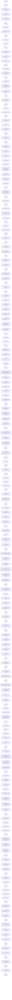

# Trachi/Central/Stuart Alley/GooseShed/HQ 2

```mermaid
graph TD
    9_0["Actor_3"]
    9_2["Actor_4"]
    9_3["Actor_4: pic=15You're out of your mind."]
    9_4["Actor_3: NCI know it's a long shot."]
    9_5["Actor_3: But it's our best one, too."]
    9_6["Actor_3"]
    9_7["Actor_4: RCRight."]
    9_8["Actor_4: RGood luck with that."]
    9_9["Actor_4"]
    9_10["Actor_6: pic=10..."]
    9_11["Actor_4: Allie..."]
    9_12["Actor_4: SDon't tell me he's roping you in.."]
    9_13["Actor_6: pic=10To be honest..."]
    9_14["Actor_6: SCI agree with Iky."]
    9_15["Actor_6"]
    9_16["Actor_3: NCThat's fair."]
    9_17["Actor_3: And completely understandable."]
    9_18["Actor_3"]
    9_19["Actor_6: pic=10Sorry."]
    9_20["Actor_6: NSCBut it's the only reasonable option here."]
    9_21["Actor_3: You don't need to apologise."]
    9_22["Actor_3: RCIf anything, I'm the one to blame."]
    9_23["Actor_3"]
    9_24["Actor_4: SC..."]
    9_25["Actor_4: SWhat did you do?"]
    9_26["Actor_4"]
    9_27["Actor_3: SCAtlas wanted insurance."]
    9_28["Actor_4: SLike what?"]
    9_29["Actor_3: SCThe names of two people."]
    9_30["Actor_3: SMe and my brother."]
    9_31["Actor_4: pic=16Jesus fucking christ."]
    9_32["Actor_4: pic=15Are you insane?"]
    9_33["Actor_3: NCIf this works out..."]
    9_34["Actor_3: It'll be worth it."]
    9_35["Actor_4: SCIf, yeah!"]
    9_36["Actor_4: SThere’s no telling if Gany even gets here in one piece!"]
    9_37["Actor_5: NCI wouldn't worry about him."]
    9_38["Actor_5: Atlas said he'll keep him safe."]
    9_39["Actor_4: SCGreat."]
    9_40["Actor_4: SBecause two EnTARDs can't be worse than one, right?"]
    9_41["Actor_5: NCYou're right."]
    9_42["Actor_5"]
    9_43["Actor_5: NCNiky..."]
    9_45["Actor_4: NCWho's the target?"]
    9_46["Actor_3: Do you really want to know?"]
    9_47["Actor_4"]
    9_48["Actor_4: RCListen, Greg."]
    9_49["Actor_4: RWe've always stuck with you."]
    9_50["Actor_4: RCFrom the moment we met..."]
    9_51["Actor_4: SCTo that bullshit with that dam."]
    9_52["Actor_4: SI didn’t mind helping you set this up."]
    9_53["Actor_4: SCBut if you really want us to throw ourselves into the fire…"]
    9_54["Actor_4: SWe need to know what's going on."]
    9_55["Actor_4"]
    9_56["Actor_3: NCAlright."]
    9_57["Actor_3: I'll tell you."]
    9_58["Actor_3"]
    9_59["Actor_3: RCJust keep in mind she'll come for you."]
    9_60["Actor_3: RAnd if that happens-"]
    9_61["Actor_6: pic=10We know, Greg."]
    9_62["Actor_3: NCOkay."]
    9_63["Actor_3"]
    9_66["Actor_3: Atlas, Daphne and Ganymede."]
    9_67["Actor_3: NCTomorrow afternoon, three people will arrive in color=811e1eTcolor=FFFFFFrachi."]
    9_69["Actor_3: NCTheir mission is as follows:"]
    9_70["Actor_3: Infiltrate the city."]
    9_71["Actor_3: SInstigate a civil war."]
    9_72["Actor_3: SCAnd finally..."]
    9_73["Actor_3: SInstall a puppet administration."]
    9_74["Actor_3"]
    9_75["Actor_3: NCSo much for the official part."]
    9_76["Actor_3: As you know, Hyperion has his eyes both on me and Eury."]
    9_77["Actor_3: NCFor you two and Ganymede, though…"]
    9_78["Actor_3: SCHe’s got something else in mind."]
    9_79["Actor_3"]
    9_80["Actor_3: SCLet's say color=811e1eacolor=FFFFFFrteria fails..."]
    9_82["Actor_3: SSomeone's got to take the blame."]
    9_83["Actor_3: And dead people can’t defend themselves very well."]
    9_84["Actor_3"]
    9_92["Actor_4: How does he know we're here, in the first place?"]
    9_93["Actor_4"]
    9_94["Actor_4: Greg?"]
    9_95["Actor_4"]
    9_97["Actor_6: SCYou'll tell us, right?"]
    9_98["Actor_6"]
    9_99["Actor_3: I leaked it."]
    9_100["Actor_4: SWhen?"]
    9_101["Actor_3: Half a year ago."]
    9_102["Actor_3"]
    9_103["Actor_4: SCFor your brother's sake..."]
    9_104["Actor_4: SI won't shoot you in the head, even though I should."]
    9_105["Actor_3: NCI appreciate it."]
    9_106["Actor_4"]
    9_107["Actor_3: But you don't need to do this for him."]
    9_108["Actor_3: NCThink about the city."]
    9_109["Actor_3: And how much you want to set it free."]
    9_112["Actor_3: NCI made her choose."]
    9_113["Actor_3: And Atlas, too, a few weeks after that."]
    9_114["Actor_3"]
    9_115["Actor_3: We'd become our own people."]
    9_117["Actor_3: NCAnd put an end to color=811e1eIcolor=FFFFFFonia."]
    9_118["Actor_3"]
    9_119["Actor_3: The three of us provoked color=811e1eacolor=FFFFFFrteria."]
    9_121["Actor_3: Fero gave his okay."]
    9_123["Actor_3: One of us."]
    9_124["Actor_3: NCTwo of them."]
    9_130["Actor_3: Though hopefully, we'll have everyone on our side come the 28th."]
    9_131["Actor_4: Even Daph?"]
    9_132["Actor_3: Yeah."]
    9_133["Actor_3: NCEven her."]
    9_134["Actor_4: You don't honestly think..."]
    9_136["Actor_3: Atlas said he'll force her."]
    9_137["Actor_4: Force her to do what?"]
    9_138["Actor_3"]
    9_139["Actor_3: Planting both herself and Ganymede in color=811e1eIcolor=FFFFFFonia."]
    9_140["Actor_3: NCMaking sure that there’s no more operations like these."]
    9_141["Actor_3: And once we’re standing on our own feet…"]
    9_142["Actor_3"]
    9_143["Actor_3: Kill Hyperion."]
    9_144["Actor_3: SAlong with the entire comittee."]
    9_145["Actor_4: Thats what he promised?"]
    9_146["Actor_3: NCYeah."]
    9_147["Actor_4: NCSorry to repeat myself."]
    9_148["Actor_4: But what exactly makes you sure he won’t fuck us over?"]
    9_149["Actor_4: SAnd don’t give me the revenge bullshit again…"]
    9_150["Actor_4: SCBecause that ain’t cutting it."]
    9_151["Actor_4"]
    9_152["Actor_5: Do you have family, Niky?"]
    9_153["Actor_4: SHuh?"]
    9_154["Actor_5: You do, right?"]
    9_155["Actor_5: NCEveryone does."]
    9_157["Actor_5"]
    9_158["Actor_5: NCAccording to our files, Atlas' parents died between 03 and 05."]
    9_160["Actor_5: NCAccording to him, his father was shot dead in 04."]
    9_161["Actor_5: Leaving his mother as his last remaining relative."]
    9_162["Actor_5"]
    9_163["Actor_5: She’s a lovely lady, very endearing."]
    9_164["Actor_5: NCFar too precious for this world."]
    9_165["Actor_5: NCI've met her once, actually."]
    9_166["Actor_5"]
    9_167["Actor_5: NCIf Atlas isn't with us by the 28th..."]
    9_168["Actor_5: I’ll make him."]
    9_169["Actor_5"]
    9_170["Actor_4: You'd go this far?"]
    9_171["Actor_5: NCI told you."]
    9_172["Actor_5: I know him."]
    9_174["Actor_5"]
    9_175["Actor_5: If push comes to shove, I'll confront him."]
    9_176["Actor_5: NCAnd if he still wants to walk the line…"]
    9_177["Actor_5: I’ll drag him across, myself."]
    9_178["Actor_5"]
    9_179["Actor_3: NCYou see, we’re all tied up in this, in some way."]
    9_180["Actor_3: Everyone but the two of you."]
    9_181["Actor_3: NCI know you love this city."]
    9_182["Actor_3: But you can still leave."]
    9_183["Actor_3: NCFor me, my brother and Eury here…    "]
    9_184["Actor_3"]
    9_185["Actor_3: There’s no turning back."]
    9_186["Actor_3"]
    9_187["Actor_3: NCThen again, if I’m to be brutally honest…"]
    9_188["Actor_3"]
    9_189["Actor_3: I'm done running, anyway."]
    9_191["Actor_3"]
    9_192["Actor_5"]
    9_193["Actor_3"]
    9_194["Actor_6: pic=10You know this is our home, right?"]
    9_195["Actor_3: I do."]
    9_196["Actor_6: SCThen why in god's name are you setting it on fire?"]
    9_197["Actor_3: NCIt's the only way to save it."]
    9_198["Actor_3: You remember operation color=811e1eecolor=FFFFFFffigy?"]
    9_199["Actor_3: NCMe and Eury were sent here for a reason."]
    9_200["Actor_3"]
    9_201["Actor_3: We had everything in place."]
    9_202["Actor_3: SThe city was swarming with color=811e1eIcolor=FFFFFFonians."]
    9_203["Actor_3: SCSolka would've marched his people to the parliament."]
    9_204["Actor_3: RAnd we'd all be speaking Greek, again."]
    9_205["Actor_4: That's what color=811e1eecolor=FFFFFFffigy was about?"]
    9_206["Actor_3: Yeah."]
    9_207["Actor_4: SWhy didn't you tell us?"]
    9_208["Actor_3: NCBecause I'm a traitor."]
    9_209["Actor_3: I never told Solka about his orders."]
    9_210["Actor_3: And I didn't want you to become traitors, too."]
    9_212["Actor_3"]
    9_213["Actor_3"]
    9_214["Actor_3: RCI care too much about this city, you see."]
    9_215["Actor_3"]
    9_216["Actor_3: NCI let myself get caught by Eury."]
    9_217["Actor_3: And told her the entire truth."]
    9_218["Actor_3: NCThe role I played in her sister's death."]
    9_219["Actor_3: To me committing acts of treason."]
    9_220["Actor_4"]
    9_222["Actor_3"]
    9_223["Actor_3"]
    9_224["Actor_4"]
    9_225["Actor_4"]
    9_226["Actor_4: SCNo offense."]
    9_228["Actor_5: You can trust him as much as you can trust me."]
    9_229["Actor_4: SCYeah, right."]
    9_230["Actor_4"]
    9_231["Actor_5: Look into my eyes."]
    9_232["Actor_5: I died a long time ago."]
    9_233["Actor_5: NCSomeone took my sister from me."]
    9_234["Actor_5: And there's no way to ever bring her back."]
    9_235["Actor_5"]
    9_236["Actor_5"]
    9_237["Actor_5: But the thing she fought against..."]
    9_238["Actor_5: NCStill lives and breathes."]
    9_241["Actor_5: Imagine my rage, multiplied a thousandfold."]
    9_242["Actor_5"]
    9_244["Actor_5: NCThat's what Atlas is going through."]
    9_245["Actor_5"]
    9_246["Actor_3: NCWe offered Hyperion everything we could."]
    9_247["Actor_3: Ganymede volunteered."]
    9_248["Actor_3"]
    9_249["Actor_4"]
    9_250["Actor_3"]
    9_251["Actor_3"]
    9_252["Actor_3"]
    9_0 --> 9_2
    9_2 --> 9_3
    9_3 --> 9_4
    9_4 --> 9_5
    9_5 --> 9_6
    9_6 --> 9_7
    9_7 --> 9_8
    9_8 --> 9_9
    9_9 --> 9_10
    9_10 --> 9_11
    9_11 --> 9_220
    9_12 --> 9_13
    9_13 --> 9_14
    9_14 --> 9_15
    9_15 --> 9_16
    9_16 --> 9_17
    9_17 --> 9_18
    9_18 --> 9_19
    9_19 --> 9_20
    9_20 --> 9_21
    9_21 --> 9_222
    9_22 --> 9_23
    9_23 --> 9_24
    9_24 --> 9_25
    9_25 --> 9_26
    9_26 --> 9_27
    9_27 --> 9_28
    9_28 --> 9_29
    9_29 --> 9_223
    9_30 --> 9_224
    9_31 --> 9_32
    9_32 --> 9_33
    9_33 --> 9_34
    9_34 --> 9_35
    9_35 --> 9_36
    9_36 --> 9_37
    9_37 --> 9_38
    9_38 --> 9_39
    9_39 --> 9_249
    9_40 --> 9_225
    9_41 --> 9_228
    9_42 --> 9_43
    9_43 --> 9_231
    9_45 --> 9_47
    9_46 --> 9_48
    9_47 --> 9_46
    9_48 --> 9_49
    9_49 --> 9_50
    9_50 --> 9_51
    9_51 --> 9_52
    9_52 --> 9_53
    9_53 --> 9_54
    9_54 --> 9_55
    9_55 --> 9_56
    9_56 --> 9_57
    9_57 --> 9_58
    9_58 --> 9_59
    9_59 --> 9_60
    9_60 --> 9_61
    9_61 --> 9_62
    9_62 --> 9_63
    9_63 --> 9_67
    9_66 --> 9_69
    9_67 --> 9_66
    9_69 --> 9_70
    9_70 --> 9_71
    9_71 --> 9_72
    9_72 --> 9_73
    9_73 --> 9_74
    9_74 --> 9_75
    9_75 --> 9_76
    9_76 --> 9_77
    9_77 --> 9_78
    9_78 --> 9_79
    9_79 --> 9_80
    9_80 --> 9_82
    9_82 --> 9_83
    9_83 --> 9_84
    9_84 --> 9_92
    9_92 --> 9_93
    9_93 --> 9_94
    9_94 --> 9_95
    9_95 --> 9_97
    9_97 --> 9_98
    9_98 --> 9_99
    9_99 --> 9_100
    9_100 --> 9_101
    9_101 --> 9_102
    9_102 --> 9_103
    9_103 --> 9_104
    9_104 --> 9_106
    9_105 --> 9_107
    9_106 --> 9_105
    9_107 --> 9_108
    9_108 --> 9_109
    9_109 --> 9_193
    9_112 --> 9_250
    9_113 --> 9_114
    9_114 --> 9_115
    9_115 --> 9_117
    9_117 --> 9_118
    9_118 --> 9_119
    9_119 --> 9_246
    9_121 --> 9_247
    9_123 --> 9_124
    9_124 --> 9_130
    9_130 --> 9_252
    9_131 --> 9_132
    9_132 --> 9_133
    9_133 --> 9_134
    9_134 --> 9_136
    9_136 --> 9_138
    9_137 --> 9_139
    9_138 --> 9_137
    9_139 --> 9_140
    9_140 --> 9_141
    9_141 --> 9_142
    9_142 --> 9_143
    9_143 --> 9_144
    9_144 --> 9_145
    9_145 --> 9_146
    9_146 --> 9_147
    9_147 --> 9_148
    9_148 --> 9_149
    9_149 --> 9_150
    9_150 --> 9_151
    9_151 --> 9_152
    9_152 --> 9_153
    9_153 --> 9_154
    9_154 --> 9_155
    9_155 --> 9_157
    9_157 --> 9_158
    9_158 --> 9_160
    9_160 --> 9_161
    9_161 --> 9_162
    9_162 --> 9_165
    9_163 --> 9_164
    9_164 --> 9_166
    9_165 --> 9_163
    9_166 --> 9_167
    9_167 --> 9_168
    9_168 --> 9_169
    9_169 --> 9_170
    9_170 --> 9_171
    9_171 --> 9_172
    9_172 --> 9_174
    9_174 --> 9_175
    9_175 --> 9_176
    9_176 --> 9_177
    9_177 --> 9_178
    9_178 --> 9_179
    9_179 --> 9_180
    9_180 --> 9_181
    9_181 --> 9_182
    9_182 --> 9_184
    9_183 --> 9_185
    9_184 --> 9_183
    9_185 --> 9_186
    9_186 --> 9_187
    9_187 --> 9_188
    9_188 --> 9_189
    9_189 --> 9_191
    9_192 --> 9_45
    9_193 --> 9_194
    9_194 --> 9_195
    9_195 --> 9_196
    9_196 --> 9_197
    9_197 --> 9_200
    9_198 --> 9_199
    9_199 --> 9_201
    9_200 --> 9_198
    9_201 --> 9_202
    9_202 --> 9_203
    9_203 --> 9_204
    9_204 --> 9_251
    9_205 --> 9_206
    9_206 --> 9_207
    9_207 --> 9_208
    9_208 --> 9_210
    9_209 --> 9_212
    9_210 --> 9_213
    9_212 --> 9_214
    9_213 --> 9_209
    9_214 --> 9_215
    9_215 --> 9_216
    9_216 --> 9_217
    9_217 --> 9_218
    9_218 --> 9_219
    9_219 --> 9_112
    9_220 --> 9_12
    9_222 --> 9_22
    9_223 --> 9_30
    9_224 --> 9_31
    9_225 --> 9_226
    9_226 --> 9_230
    9_228 --> 9_229
    9_229 --> 9_42
    9_230 --> 9_41
    9_231 --> 9_235
    9_232 --> 9_245
    9_233 --> 9_234
    9_234 --> 9_236
    9_235 --> 9_232
    9_236 --> 9_237
    9_237 --> 9_238
    9_238 --> 9_242
    9_241 --> 9_244
    9_242 --> 9_241
    9_244 --> 9_192
    9_245 --> 9_233
    9_246 --> 9_121
    9_247 --> 9_248
    9_248 --> 9_123
    9_249 --> 9_40
    9_250 --> 9_113
    9_251 --> 9_205
    9_252 --> 9_131
```