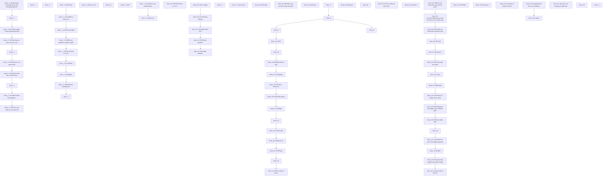

# Trachi/Central/Stuart Alley (E)

```mermaid
graph TD
    72_0["Actor_-1"]
    72_19["Actor_-1"]
    72_26["Actor_-1"]
    72_29["Actor_-1: NCAnd here I was thinking we had something special..."]
    72_30["Actor_-1"]
    72_31["Actor_-1: pic=6Then again, I don't mind being used."]
    72_32["Actor_-1: NSCAs long as I get to use you, too."]
    72_33["Actor_-1"]
    72_34["Actor_-1: pic=6But before that happens..."]
    72_36["Actor_-1: NSCLet's see what we can find out!"]
    72_40["Actor_-1: RCUntil one of us gets bored."]
    72_41["Actor_-1: RAnd the other one is left in tears."]
    72_42["Actor_-1"]
    72_75["Actor_7: Who are you?"]
    72_80["Actor_20"]
    72_83["Actor_9"]
    72_86["Actor_-1: NSC"]
    72_88["Actor_-1: NSCLorna."]
    72_90["Actor_-1: NSCVicky!"]
    72_91["Actor_-1: pic=10Take a look at th-"]
    72_92["Actor_-1: pic=6It's adorable."]
    72_93["Actor_-1: NSCBut we wanted to unpack, right?"]
    72_94["Actor_-1: NSCI'll be there in a sec-"]
    72_95["Actor_-1: pic=10Now."]
    72_96["Actor_16: NSCI'll be there in a sec-"]
    72_97["Actor_-1: NCAlright."]
    72_98["Actor_-1: NSCPleasure meeting you!"]
    72_102["Actor_-1: pic=6She's very excited about "]
    72_104["Actor_-1"]
    72_110["Actor_-1: Over there?"]
    72_146["Actor_-1"]
    72_151["Actor_23: NSCYeah."]
    72_156["Actor_16: NSCWere you out here all by yourself?"]
    72_159["Actor_16: NCDamn."]
    72_160["Actor_23: NCIt's alright."]
    72_161["Actor_16: NCDamn."]
    72_162["Actor_23: pic=6I'll keep looking."]
    72_163["Actor_23: NSCWhat about you?"]
    72_166["Actor_16: NCSimilar situation."]
    72_167["Actor_16: NCSimilar situation."]
    72_168["Actor_16"]
    72_172["Actor_23: NCYou could say that, yeah."]
    72_174["Actor_16: pic=6Hm."]
    72_181["Actor_16: NSCDo you know your way around here?"]
    72_182["Actor_23: pic=6Considering you had to bail me out a minute ago."]
    72_183["Actor_23: NSCI think we should ask someone else."]
    72_184["Actor_16: NCYeah."]
    72_185["Actor_16: But where?"]
    72_186["Actor_23: NSCShould get us straight to the northern gate."]
    72_187["Actor_16: NCYeah, about that."]
    72_190["Actor_16: I don't think it's much of a bridge anymore."]
    72_191["Actor_23: Really?"]
    72_192["Actor_23: NCI guess that explains the bang I heard."]
    72_193["Actor_16: Is there another way in?"]
    72_205["Actor_23: NSCCity would be a start."]
    72_207["Actor_23: pic=6There's a bridge down south."]
    72_209["Actor_16"]
    72_210["Actor_27: NSCYeah."]
    72_259["Actor_16: A city?"]
    72_260["Actor_23: NGDYeah!"]
    72_261["Actor_16: NCI guess."]
    72_262["Actor_10"]
    72_267["Actor_23: How does it make you feel?"]
    72_279["Actor_23: Everybody has their own medicine."]
    72_280["Actor_23: And she's not seeing you right now."]
    72_281["Actor_16: I guess."]
    72_307["Actor_16"]
    72_308["Actor_13: SHm?"]
    72_309["Actor_-1"]
    72_310["Actor_10: NSWhat did you say?"]
    72_311["Actor_13: SCNothing."]
    72_312["Actor_13: SPCJust... memories."]
    72_313["Actor_10: NSCPlenty, lately."]
    72_314["Actor_13: NCRight."]
    72_315["Actor_13"]
    72_316["Actor_13: Good to go?"]
    72_317["Actor_10: NSAll set up."]
    72_319["Actor_13: SPCOkay."]
    72_320["Actor_13"]
    72_321["Actor_13: SPLet's bring it home."]
    72_322["Actor_9"]
    72_323["Actor_9"]
    72_0 --> 72_83
    72_29 --> 72_30
    72_30 --> 72_31
    72_31 --> 72_32
    72_32 --> 72_33
    72_33 --> 72_40
    72_34 --> 72_36
    72_40 --> 72_41
    72_41 --> 72_42
    72_42 --> 72_34
    72_83 --> 72_323
    72_83 --> 72_322
    72_90 --> 72_91
    72_91 --> 72_92
    72_92 --> 72_93
    72_93 --> 72_94
    72_94 --> 72_95
    72_95 --> 72_97
    72_97 --> 72_98
    72_98 --> 72_146
    72_102 --> 72_88
    72_160 --> 72_162
    72_162 --> 72_163
    72_163 --> 72_166
    72_166 --> 72_167
    72_181 --> 72_182
    72_182 --> 72_183
    72_183 --> 72_184
    72_184 --> 72_185
    72_185 --> 72_205
    72_186 --> 72_187
    72_187 --> 72_209
    72_190 --> 72_191
    72_191 --> 72_192
    72_192 --> 72_193
    72_205 --> 72_259
    72_207 --> 72_186
    72_209 --> 72_190
    72_259 --> 72_260
    72_260 --> 72_207
    72_262 --> 72_310
    72_279 --> 72_281
    72_308 --> 72_262
    72_310 --> 72_311
    72_311 --> 72_312
    72_312 --> 72_313
    72_313 --> 72_314
    72_314 --> 72_315
    72_315 --> 72_316
    72_316 --> 72_317
    72_317 --> 72_319
    72_319 --> 72_320
    72_320 --> 72_321
    72_323 --> 72_308
```