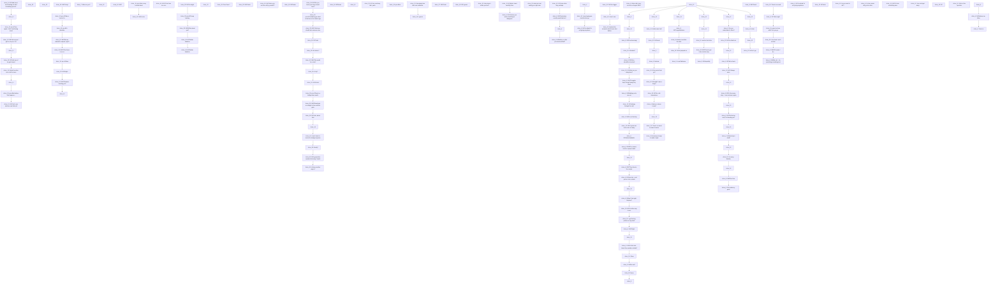

# Trachi/Central/Stuart Alley (E)/Goose Shed/Foyer

```mermaid
graph TD
    74_0["Actor_13"]
    74_19["Actor_13"]
    74_26["Actor_13"]
    74_29["Actor_13: NCAnd here I was thinking we had something special..."]
    74_30["Actor_13"]
    74_31["Actor_13: pic=6Then again, I don't mind being used."]
    74_32["Actor_13: NSCAs long as I get to use you, too."]
    74_33["Actor_13"]
    74_34["Actor_13: pic=6But before that happens..."]
    74_36["Actor_13: NSCLet's see what we can find out!"]
    74_40["Actor_13: RCUntil one of us gets bored."]
    74_41["Actor_13: RAnd the other one is left in tears."]
    74_42["Actor_13"]
    74_75["Actor_7: Who are you?"]
    74_80["Actor_20"]
    74_83["Actor_9"]
    74_86["Actor_10: NSC"]
    74_88["Actor_10: NSCLorna."]
    74_90["Actor_13: NSCVicky!"]
    74_91["Actor_13: pic=10Take a look at th-"]
    74_92["Actor_10: pic=6It's adorable."]
    74_93["Actor_10: NSCBut we wanted to unpack, right?"]
    74_94["Actor_13: NSCI'll be there in a sec-"]
    74_95["Actor_10: pic=10Now."]
    74_96["Actor_16: NSCI'll be there in a sec-"]
    74_97["Actor_13: NCAlright."]
    74_98["Actor_13: NSCPleasure meeting you!"]
    74_102["Actor_10: pic=6She's very excited about "]
    74_104["Actor_13"]
    74_110["Actor_13: Over there?"]
    74_146["Actor_10"]
    74_151["Actor_23: NSCYeah."]
    74_156["Actor_16: NSCWere you out here all by yourself?"]
    74_159["Actor_16: NCDamn."]
    74_160["Actor_23: NCIt's alright."]
    74_161["Actor_16: NCDamn."]
    74_162["Actor_23: pic=6I'll keep looking."]
    74_163["Actor_23: NSCWhat about you?"]
    74_166["Actor_16: NCSimilar situation."]
    74_167["Actor_16: NCSimilar situation."]
    74_168["Actor_16"]
    74_172["Actor_23: NCYou could say that, yeah."]
    74_174["Actor_16: pic=6Hm."]
    74_179["Actor_13"]
    74_181["Actor_16: NSCDo you know your way around here?"]
    74_182["Actor_23: pic=6Considering you had to bail me out a minute ago."]
    74_183["Actor_23: NSCI think we should ask someone else."]
    74_184["Actor_16: NCYeah."]
    74_185["Actor_16: But where?"]
    74_186["Actor_23: NSCShould get us straight to the northern gate."]
    74_187["Actor_16: NCYeah, about that."]
    74_190["Actor_16: I don't think it's much of a bridge anymore."]
    74_191["Actor_23: Really?"]
    74_192["Actor_23: NCI guess that explains the bang I heard."]
    74_193["Actor_16: Is there another way in?"]
    74_205["Actor_23: NSCCity would be a start."]
    74_207["Actor_23: pic=6There's a bridge down south."]
    74_209["Actor_16"]
    74_210["Actor_27: NSCYeah."]
    74_259["Actor_16: A city?"]
    74_260["Actor_23: NGDYeah!"]
    74_261["Actor_16: NCI guess."]
    74_267["Actor_23: How does it make you feel?"]
    74_279["Actor_23: Everybody has their own medicine."]
    74_280["Actor_23: And she's not seeing you right now."]
    74_281["Actor_16: I guess."]
    74_308["Actor_6: NSGood evening!"]
    74_310["Actor_6: RSDYou should've knocked!"]
    74_311["Actor_13: SCWhat are you doing here?"]
    74_312["Actor_6: NSCThoughts kept racing through my head."]
    74_313["Actor_6: NSWalking sorts me out."]
    74_314["Actor_13: SCHalfway through the city?"]
    74_315["Actor_6: NSIt's not that big."]
    74_316["Actor_13: NPCI guess we took a turn to many."]
    74_317["Actor_6: NSUnderstandable."]
    74_318["Actor_6: RSDThe sewers can be a proper maze."]
    74_319["Actor_13"]
    74_320["Actor_6: RSCThen there's the canals."]
    74_321["Actor_6: RSOne slip – and you're in for a swim!"]
    74_325["Actor_13: NCBetter tread carefully then."]
    74_326["Actor_6: NSCUnless you want something to disappear."]
    74_327["Actor_13"]
    74_328["Actor_6: NSIsn't that right, Daphne?"]
    74_329["Actor_10: NCIt's either way to me."]
    74_330["Actor_10: I got the big picture on my mind."]
    74_333["Actor_10: NCSome other day, perhaps."]
    74_334["Actor_6: NSCAnd when exactly would that be?"]
    74_335["Actor_6: NSBefore or after you had me killed?"]
    74_336["Actor_6"]
    74_337["Actor_10: I was hoping we could let that go."]
    74_338["Actor_6"]
    74_339["Actor_6: NCI'm afraid it's not going anywhere."]
    74_341["Actor_13: None."]
    74_342["Actor_6: When did it ever not rain on August 28th?"]
    74_346["Actor_6: NSOn that note: How's the weather outside?"]
    74_347["Actor_13: SAriadne?"]
    74_348["Actor_10"]
    74_349["Actor_13"]
    74_350["Actor_13: Clear."]
    74_351["Actor_6: NSNo rain?"]
    74_352["Actor_13"]
    74_353["Actor_13: SWhat was that?"]
    74_354["Actor_10: SA threat."]
    74_355["Actor_6: Sarteria."]
    74_356["Actor_10: SCan we let that go?"]
    74_357["Actor_10: Pull the trigger."]
    74_358["Actor_10: I don't care."]
    74_359["Actor_13: Spoken like someone who's been shot before."]
    74_362["Actor_6: NSCRight."]
    74_363["Actor_6: NSCGood."]
    74_364["Actor_13: There's no need."]
    74_365["Actor_6: SCThat's right."]
    74_366["Actor_6: Leave her here and I'll let you go."]
    74_367["Actor_6: RCI'm afraid it's not going anywhere."]
    74_368["Actor_13: You know I won't do that."]
    74_369["Actor_6: NSCOf course I do."]
    74_370["Actor_6: NSAfter all – I'm protecting something too!"]
    74_371["Actor_6: Do you understand it, Atlas?"]
    74_372["Actor_13: NCI'm afraid not."]
    74_373["Actor_6: RCWe're fools."]
    74_374["Actor_13: NPCAlways were."]
    74_375["Actor_6: NPIt's the same story – over and over again."]
    74_377["Actor_6: NCThat being said, I'm bleeding out."]
    74_380["Actor_13: I'm sorry, Ariadne."]
    74_382["Actor_13"]
    74_383["Actor_13"]
    74_384["Actor_10: Atlas."]
    74_385["Actor_13"]
    74_386["Actor_13: NCLet's go."]
    74_387["Actor_10: NCYeah."]
    74_388["Actor_13"]
    74_389["Actor_6: NCCongratulations."]
    74_390["Actor_6: Another one bites the dust."]
    74_391["Actor_10: NCHe jumped us."]
    74_392["Actor_6: In self-defense."]
    74_395["Actor_13"]
    74_396["Actor_13"]
    74_397["Actor_6: I want to feel alive."]
    74_398["Actor_13: NPCThere's got to be a better way."]
    74_399["Actor_13: Do you want to die?"]
    74_400["Actor_6: NSHopefully."]
    74_404["Actor_6: It's the reason why you're alive."]
    74_405["Actor_13"]
    74_407["Actor_13"]
    74_409["Actor_13: NSCTell me something new."]
    74_410["Actor_9"]
    74_411["Actor_9"]
    74_414["Actor_6: Below or above Icarus?"]
    74_415["Actor_6: SI thought I was a target."]
    74_416["Actor_13: NCOn a list somewhere."]
    74_417["Actor_13: You could get away."]
    74_418["Actor_13: SC"]
    74_419["Actor_10: SOut of the question."]
    74_420["Actor_6"]
    74_421["Actor_6: NCBelieve me, Atlas."]
    74_424["Actor_6: NSWould you mind?"]
    74_425["Actor_6: NSCDon't be."]
    74_426["Actor_6: NSI made my point."]
    74_427["Actor_13"]
    74_428["Actor_13"]
    74_429["Actor_13"]
    74_430["Actor_6: There is."]
    74_431["Actor_13: There's no need to make it worse."]
    74_432["Actor_13"]
    74_433["Actor_6: But plenty of ways to make it right."]
    74_0 --> 74_83
    74_0 --> 74_352
    74_0 --> 74_388
    74_0 --> 74_395
    74_0 --> 74_348
    74_0 --> 74_427
    74_29 --> 74_30
    74_30 --> 74_31
    74_31 --> 74_32
    74_32 --> 74_33
    74_33 --> 74_40
    74_34 --> 74_36
    74_40 --> 74_41
    74_41 --> 74_42
    74_42 --> 74_34
    74_83 --> 74_179
    74_90 --> 74_91
    74_91 --> 74_92
    74_92 --> 74_93
    74_93 --> 74_94
    74_94 --> 74_95
    74_95 --> 74_97
    74_97 --> 74_98
    74_98 --> 74_146
    74_102 --> 74_88
    74_160 --> 74_162
    74_162 --> 74_163
    74_163 --> 74_166
    74_166 --> 74_167
    74_179 --> 74_308
    74_181 --> 74_182
    74_182 --> 74_183
    74_183 --> 74_184
    74_184 --> 74_185
    74_185 --> 74_205
    74_186 --> 74_187
    74_187 --> 74_209
    74_190 --> 74_191
    74_191 --> 74_192
    74_192 --> 74_193
    74_205 --> 74_259
    74_207 --> 74_186
    74_209 --> 74_190
    74_259 --> 74_260
    74_260 --> 74_207
    74_279 --> 74_281
    74_308 --> 74_347
    74_310 --> 74_311
    74_311 --> 74_312
    74_312 --> 74_313
    74_313 --> 74_314
    74_314 --> 74_315
    74_315 --> 74_316
    74_316 --> 74_317
    74_317 --> 74_318
    74_318 --> 74_319
    74_319 --> 74_320
    74_320 --> 74_321
    74_321 --> 74_327
    74_325 --> 74_326
    74_327 --> 74_328
    74_328 --> 74_329
    74_329 --> 74_330
    74_330 --> 74_362
    74_333 --> 74_334
    74_334 --> 74_336
    74_336 --> 74_335
    74_337 --> 74_339
    74_338 --> 74_337
    74_341 --> 74_411
    74_346 --> 74_350
    74_347 --> 74_310
    74_348 --> 74_371
    74_349 --> 74_346
    74_350 --> 74_351
    74_351 --> 74_341
    74_352 --> 74_353
    74_353 --> 74_354
    74_354 --> 74_410
    74_355 --> 74_356
    74_356 --> 74_415
    74_357 --> 74_358
    74_358 --> 74_359
    74_362 --> 74_349
    74_364 --> 74_365
    74_365 --> 74_366
    74_366 --> 74_368
    74_368 --> 74_369
    74_369 --> 74_370
    74_371 --> 74_372
    74_372 --> 74_407
    74_373 --> 74_374
    74_374 --> 74_429
    74_375 --> 74_405
    74_377 --> 74_382
    74_380 --> 74_383
    74_382 --> 74_424
    74_383 --> 74_425
    74_384 --> 74_385
    74_385 --> 74_386
    74_388 --> 74_389
    74_389 --> 74_390
    74_390 --> 74_391
    74_391 --> 74_392
    74_395 --> 74_396
    74_396 --> 74_397
    74_397 --> 74_398
    74_398 --> 74_400
    74_405 --> 74_377
    74_407 --> 74_373
    74_410 --> 74_355
    74_414 --> 74_432
    74_415 --> 74_416
    74_416 --> 74_414
    74_420 --> 74_421
    74_421 --> 74_430
    74_424 --> 74_428
    74_425 --> 74_426
    74_427 --> 74_384
    74_428 --> 74_380
    74_429 --> 74_375
    74_431 --> 74_433
    74_432 --> 74_431
```