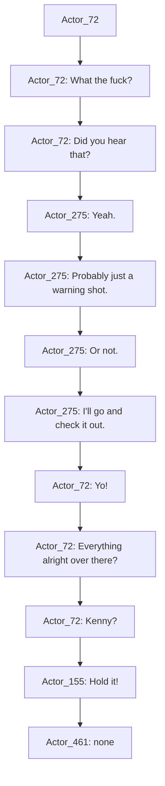

# Trachi/Checkpoint/Barracks/Cell (Checkpoint)/EV001

```mermaid
graph TD
    611_0["Actor_72"]
    611_1["Actor_72: What the fuck?"]
    611_2["Actor_72: Did you hear that?"]
    611_3["Actor_275: Yeah."]
    611_4["Actor_275: Probably just a warning shot."]
    611_5["Actor_275: Or not."]
    611_6["Actor_275: I'll go and check it out."]
    611_7["Actor_72: Yo!"]
    611_8["Actor_72: Everything alright over there?"]
    611_9["Actor_72: Kenny?"]
    611_10["Actor_155: Hold it!"]
    611_11["Actor_461: none"]
    611_0 --> 611_1
    611_1 --> 611_2
    611_2 --> 611_3
    611_3 --> 611_4
    611_4 --> 611_5
    611_5 --> 611_6
    611_6 --> 611_7
    611_7 --> 611_8
    611_8 --> 611_9
    611_9 --> 611_10
    611_10 --> 611_11
```