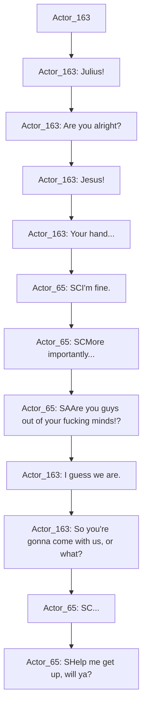

# Trachi/Checkpoint/Barracks/Cell (Checkpoint)/EV002

```mermaid
graph TD
    612_0["Actor_163"]
    612_1["Actor_163: Julius!"]
    612_2["Actor_163: Are you alright?"]
    612_3["Actor_163: Jesus!"]
    612_4["Actor_163: Your hand..."]
    612_5["Actor_65: SCI'm fine."]
    612_6["Actor_65: SCMore importantly..."]
    612_7["Actor_65: SAAre you guys out of your fucking minds!?"]
    612_8["Actor_163: I guess we are."]
    612_9["Actor_163: So you're gonna come with us, or what?"]
    612_10["Actor_65: SC..."]
    612_11["Actor_65: SHelp me get up, will ya?"]
    612_0 --> 612_1
    612_1 --> 612_2
    612_2 --> 612_3
    612_3 --> 612_4
    612_4 --> 612_5
    612_5 --> 612_6
    612_6 --> 612_7
    612_7 --> 612_8
    612_8 --> 612_9
    612_9 --> 612_10
    612_10 --> 612_11
```