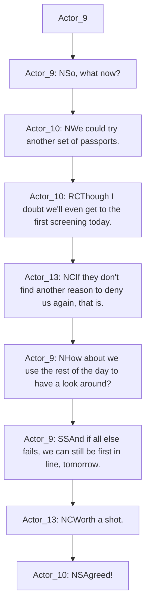

# Trachi/Checkpoint/Barracks/EV005

```mermaid
graph TD
    614_0["Actor_9"]
    614_1["Actor_9: NSo, what now?"]
    614_2["Actor_10: NWe could try another set of passports."]
    614_3["Actor_10: RCThough I doubt we'll even get to the first screening today."]
    614_4["Actor_13: NCIf they don't find another reason to deny us again, that is."]
    614_5["Actor_9: NHow about we use the rest of the day to have a look around?"]
    614_6["Actor_9: SSAnd if all else fails, we can still be first in line, tomorrow."]
    614_7["Actor_13: NCWorth a shot."]
    614_8["Actor_10: NSAgreed!"]
    614_0 --> 614_1
    614_1 --> 614_2
    614_2 --> 614_3
    614_3 --> 614_4
    614_4 --> 614_5
    614_5 --> 614_6
    614_6 --> 614_7
    614_7 --> 614_8
```