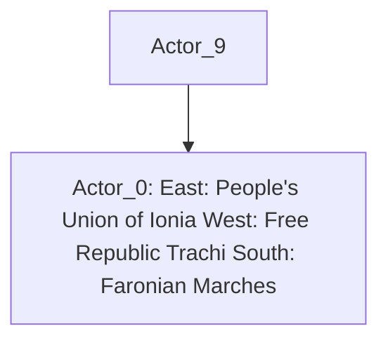

# Trachi/Checkpoint/Border/EV009

```mermaid
graph TD
    615_0["Actor_9"]
    615_1["Actor_0: East: People's Union of Ionia West: Free Republic Trachi South: Faronian Marches"]
    615_0 --> 615_1
```