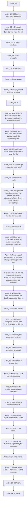

# Trachi/Checkpoint/Carriage/Daphne

```mermaid
graph TD
    616_0["Actor_10"]
    616_1["Actor_10: NCDon't you guys worry about that!"]
    616_2["Actor_10: NSI made it more than clear to him that he better not mess this up!"]
    616_3["Actor_13: SCA lot of initiative..."]
    616_4["Actor_13: SFor a counsellor."]
    616_5["Actor_10: RGDGladly!"]
    616_6["Actor_13: SCAnyways..."]
    616_7["Actor_13: NYou guys need a brief on anything?"]
    616_8["Actor_13: N"]
    616_9["Actor_13: NWe are about to reach our side of the border close to Trachi's eastern checkpoint."]
    616_10["Actor_13: NOnce we're there, we'll make contact with our man in the republican guard."]
    616_11["Actor_13: NWho will hand us the necessary papers to enter the city."]
    616_12["Actor_9: NCan't we just go through the main gate?"]
    616_13["Actor_13: NTheoretically, yeah."]
    616_14["Actor_13: NCThough there have been reports that Ionians are being subjected to heavy delays in their passport proceedings."]
    616_15["Actor_13: NSo we'd rather not take any chances."]
    616_16["Actor_9: NGDGotcha!"]
    616_17["Actor_13: NOnce we're inside, we'll disperse and make our way to the safehouse, individually."]
    616_18["Actor_13: NAnd support the embassy by gathering intelligence throughout the city."]
    616_19["Actor_13: NIt's vital that the negotiations between Trachi and our government proceed without any incidents."]
    616_20["Actor_9: NCTalks have been deadlocked for the last few weeks, so I heard."]
    616_21["Actor_13: NThat is correct."]
    616_22["Actor_13: NAnd even though we can't be sure what the reason for this is..."]
    616_23["Actor_13: NIt's likely that Amryn was involved."]
    616_24["Actor_13: NWhatever the case might be, though."]
    616_25["Actor_13: NWe're here to change that."]
    616_26["Actor_13: NWithin the next three days, that is."]
    616_27["Actor_9: NAnd what if nothing happens by the end of it?"]
    616_28["Actor_13: NLet's hope it won't come to that."]
    616_29["Actor_13: SNow, I think you're already aware of this."]
    616_30["Actor_13: SBut for the record..."]
    616_31["Actor_13: NWe're not formally recognized by the committee."]
    616_32["Actor_13: SIn other words..."]
    616_33["Actor_13: NOnce we've crossed the border, we'll be stateless."]
    616_34["Actor_13: NCAlright."]
    616_35["Actor_13: NLet's go."]
    616_0 --> 616_1
    616_1 --> 616_2
    616_2 --> 616_3
    616_3 --> 616_4
    616_4 --> 616_5
    616_5 --> 616_6
    616_6 --> 616_7
    616_7 --> 616_8
    616_8 --> 616_9
    616_9 --> 616_10
    616_10 --> 616_11
    616_11 --> 616_12
    616_12 --> 616_13
    616_13 --> 616_14
    616_14 --> 616_15
    616_15 --> 616_16
    616_16 --> 616_17
    616_17 --> 616_18
    616_18 --> 616_19
    616_19 --> 616_20
    616_20 --> 616_21
    616_21 --> 616_22
    616_22 --> 616_23
    616_23 --> 616_24
    616_24 --> 616_25
    616_25 --> 616_26
    616_26 --> 616_27
    616_27 --> 616_28
    616_28 --> 616_29
    616_29 --> 616_30
    616_30 --> 616_31
    616_31 --> 616_32
    616_32 --> 616_33
    616_33 --> 616_34
    616_34 --> 616_35
```