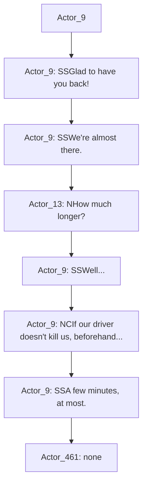

# Trachi/Checkpoint/Carriage/Ganymede Introduction

```mermaid
graph TD
    617_0["Actor_9"]
    617_1["Actor_9: SSGlad to have you back!"]
    617_2["Actor_9: SSWe're almost there."]
    617_3["Actor_13: NHow much longer?"]
    617_4["Actor_9: SSWell..."]
    617_5["Actor_9: NCIf our driver doesn't kill us, beforehand..."]
    617_6["Actor_9: SSA few minutes, at most."]
    617_7["Actor_461: none"]
    617_0 --> 617_1
    617_1 --> 617_2
    617_2 --> 617_3
    617_3 --> 617_4
    617_4 --> 617_5
    617_5 --> 617_6
    617_6 --> 617_7
```