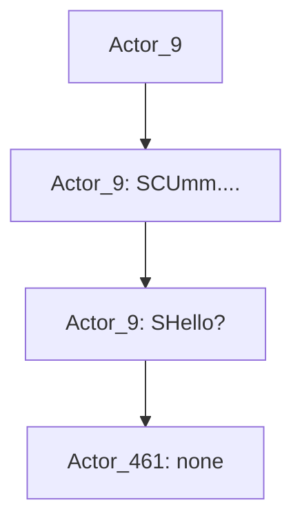

# Trachi/Checkpoint/Carriage/Player Start

```mermaid
graph TD
    618_0["Actor_9"]
    618_1["Actor_9: SCUmm...."]
    618_2["Actor_9: SHello?"]
    618_3["Actor_461: none"]
    618_0 --> 618_1
    618_1 --> 618_2
    618_2 --> 618_3
```