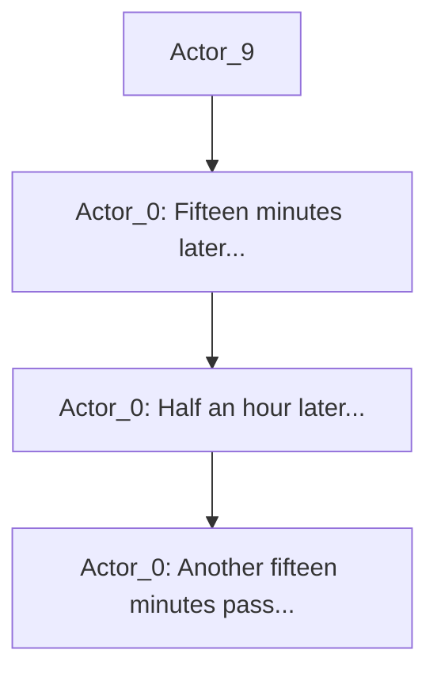

# Trachi/Checkpoint/Custom's Office (Checkpoint)/Clerk

```mermaid
graph TD
    619_0["Actor_9"]
    619_1["Actor_0: Fifteen minutes later..."]
    619_2["Actor_0: Half an hour later..."]
    619_3["Actor_0: Another fifteen minutes pass..."]
    619_0 --> 619_1
    619_1 --> 619_2
    619_2 --> 619_3
```