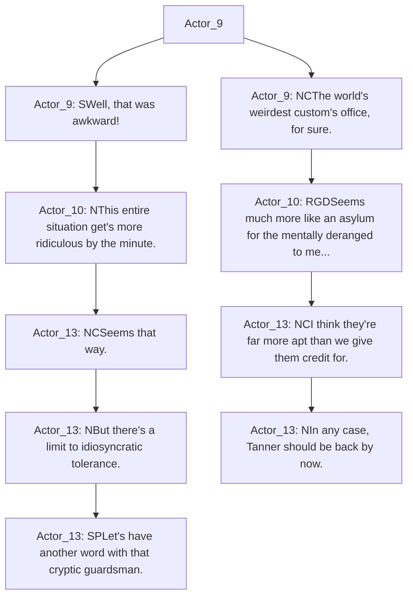

# Trachi/Checkpoint/PostDocs

```mermaid
graph TD
    622_0["Actor_9"]
    622_1["Actor_9: SWell, that was awkward!"]
    622_2["Actor_10: NThis entire situation get's more ridiculous by the minute."]
    622_3["Actor_13: NCSeems that way."]
    622_4["Actor_13: NBut there's a limit to idiosyncratic tolerance."]
    622_5["Actor_13: SPLet's have another word with that cryptic guardsman."]
    622_6["Actor_9: NCThe world's weirdest custom's office, for sure."]
    622_7["Actor_10: RGDSeems much more like an asylum for the mentally deranged to me..."]
    622_8["Actor_13: NCI think they're far more apt than we give them credit for."]
    622_9["Actor_13: NIn any case, Tanner should be back by now."]
    622_0 --> 622_1
    622_0 --> 622_6
    622_1 --> 622_2
    622_2 --> 622_3
    622_3 --> 622_4
    622_4 --> 622_5
    622_6 --> 622_7
    622_7 --> 622_8
    622_8 --> 622_9
```