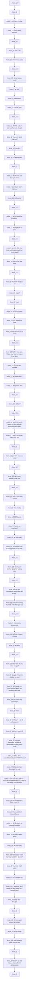

# Trachi/East/Rondham Central/Elysian/Indemnification

```mermaid
graph TD
    11_0["Actor_13"]
    11_1["Actor_3"]
    11_2["Actor_3: NCSorry I'm late."]
    11_3["Actor_13: Don't worry about it."]
    11_4["Actor_3: This is it?\n"]
    11_5["Actor_13: Preliminary print."]
    11_415["Actor_13"]
    11_416["Actor_13: What do you think?"]
    11_417["Actor_3: NCIt's..."]
    11_418["Actor_3: Aggressive."]
    11_419["Actor_13: I know, right."]
    11_420["Actor_13"]
    11_421["Actor_13: NCThe colour's a bit washed out, though."]
    11_422["Actor_3: You don't like it that way?"]
    11_423["Actor_13: You do?"]
    11_424["Actor_3: It's appropriate."]
    11_428["Actor_3"]
    11_429["Actor_13: NCIt's not your fault, you know."]
    11_430["Actor_3: pic=6Look who's talking."]
    11_431["Actor_13: SCExactly."]
    11_432["Actor_13: RCIf I would've pushed it..."]
    11_433["Actor_13: RThey'd still be alive."]
    11_434["Actor_13"]
    11_435["Actor_3: pic=6Is this what Eury had to put up with all these years?"]
    11_436["Actor_13: pic=6That and more."]
    11_437["Actor_13"]
    11_438["Actor_3: You think she'll do it?"]
    11_439["Actor_13: Daph?"]
    11_440["Actor_3: Yeah."]
    11_441["Actor_13: NCWho knows."]
    11_442["Actor_13: I've played my card."]
    11_443["Actor_13: NCThe rest is up to her."]
    11_445["Actor_13"]
    11_446["Actor_13: NCFor her sake, I hope your brother makes it out alive."]
    11_447["Actor_13: SCShe too, perhaps."]
    11_448["Actor_13: RCEither way..."]
    11_449["Actor_3: And then?"]
    11_450["Actor_13: pic=6I'm free to spend my time sulking about the past again."]
    11_451["Actor_13: RHyperion dies."]
    11_452["Actor_3: I wish I could see it that way, too."]
    11_453["Actor_3"]
    11_454["Actor_13: pic=6It's a luxury, really."]
    11_455["Actor_13"]
    11_456["Actor_13: NCI never asked, by the way."]
    11_457["Actor_13: Was it your idea or his?"]
    11_458["Actor_3: His, mostly."]
    11_459["Actor_13: NCFigures."]
    11_460["Actor_3: You're not surprised?"]
    11_461["Actor_13: NCNot really."]
    11_462["Actor_13: SCI've met a lot of crazy people in my time..."]
    11_463["Actor_13: SBut your brother takes the fucking cake."]
    11_464["Actor_13"]
    11_465["Actor_13: NCAnd considering what Daph did to him..."]
    11_466["Actor_13"]
    11_467["Actor_13: I bet he's having the time of his life right now."]
    11_468["Actor_13"]
    11_469["Actor_3: Interesting perspective."]
    11_470["Actor_13: NCOne of many, I'm sure."]
    11_471["Actor_3: NCMhm."]
    11_472["Actor_13"]
    11_473["Actor_13: How long do you think we got?"]
    11_474["Actor_3: Couple of months at least, he said."]
    11_475["Actor_3: NCThough I'm more worried about the situation right here."]
    11_476["Actor_13: You mean the assembly?"]
    11_477["Actor_3: Yeah."]
    11_478["Actor_3: NCThere's a lot of enthusiasm..."]
    11_479["Actor_3: But that'll wear off."]
    11_480["Actor_3: NSCAnd eventually, people wil remember that they need to eat."]
    11_481["Actor_13: What about color=811e1eEcolor=FFFFFFtruria?"]
    11_482["Actor_3: NCGoodwill and blessings, for now."]
    11_483["Actor_3: But they can't help us if color=811e1eAcolor=FFFFFFmryn's not letting them through."]
    11_484["Actor_3"]
    11_485["Actor_13: NCWe'll have to trade Faber in."]
    11_486["Actor_3: They want both him and Tanner."]
    11_487["Actor_13: SCSo much for general amnesty."]
    11_488["Actor_3: You got a better idea?"]
    11_489["Actor_13: NCNot really."]
    11_490["Actor_13: Unless you want me to activate her already?"]
    11_491["Actor_3: You think that'll help?"]
    11_492["Actor_13: NCProbably not."]
    11_493["Actor_13: If anything, we'd waste our only bullet on a warning shot."]
    11_494["Actor_3: That's what I thought."]
    11_495["Actor_3"]
    11_496["Actor_13: NCWe could always go pillage."]
    11_497["Actor_3: You're joking."]
    11_498["Actor_13: Just throwing ideas into the mix."]
    11_501["Actor_3: NCLet's go and have a chat with the ambassador."]
    11_502["Actor_3"]
    11_503["Actor_3"]
    11_505["Actor_13"]
    11_506["Actor_13"]
    11_507["Actor_13"]
    11_508["Actor_13"]
    11_509["Actor_13"]
    11_0 --> 11_1
    11_1 --> 11_2
    11_2 --> 11_3
    11_3 --> 11_509
    11_4 --> 11_5
    11_5 --> 11_415
    11_415 --> 11_416
    11_416 --> 11_417
    11_417 --> 11_418
    11_418 --> 11_419
    11_419 --> 11_420
    11_420 --> 11_421
    11_421 --> 11_422
    11_422 --> 11_423
    11_423 --> 11_424
    11_424 --> 11_428
    11_428 --> 11_429
    11_429 --> 11_430
    11_430 --> 11_431
    11_431 --> 11_505
    11_432 --> 11_433
    11_433 --> 11_434
    11_434 --> 11_435
    11_435 --> 11_436
    11_436 --> 11_437
    11_437 --> 11_438
    11_438 --> 11_439
    11_439 --> 11_440
    11_440 --> 11_441
    11_441 --> 11_442
    11_442 --> 11_443
    11_443 --> 11_445
    11_445 --> 11_446
    11_446 --> 11_447
    11_447 --> 11_448
    11_448 --> 11_451
    11_449 --> 11_506
    11_450 --> 11_452
    11_451 --> 11_507
    11_452 --> 11_453
    11_453 --> 11_454
    11_454 --> 11_455
    11_455 --> 11_456
    11_456 --> 11_508
    11_457 --> 11_458
    11_458 --> 11_459
    11_459 --> 11_460
    11_460 --> 11_461
    11_461 --> 11_462
    11_462 --> 11_466
    11_463 --> 11_464
    11_464 --> 11_465
    11_465 --> 11_467
    11_466 --> 11_463
    11_467 --> 11_468
    11_468 --> 11_469
    11_469 --> 11_470
    11_470 --> 11_471
    11_471 --> 11_472
    11_472 --> 11_473
    11_473 --> 11_474
    11_474 --> 11_475
    11_475 --> 11_476
    11_476 --> 11_477
    11_477 --> 11_478
    11_478 --> 11_479
    11_479 --> 11_480
    11_480 --> 11_481
    11_481 --> 11_482
    11_482 --> 11_483
    11_483 --> 11_484
    11_484 --> 11_485
    11_485 --> 11_486
    11_486 --> 11_487
    11_487 --> 11_488
    11_488 --> 11_489
    11_489 --> 11_490
    11_490 --> 11_491
    11_491 --> 11_492
    11_492 --> 11_493
    11_493 --> 11_494
    11_494 --> 11_495
    11_495 --> 11_496
    11_496 --> 11_497
    11_497 --> 11_498
    11_498 --> 11_502
    11_501 --> 11_503
    11_502 --> 11_501
    11_505 --> 11_432
    11_506 --> 11_450
    11_507 --> 11_449
    11_508 --> 11_457
    11_509 --> 11_4
```