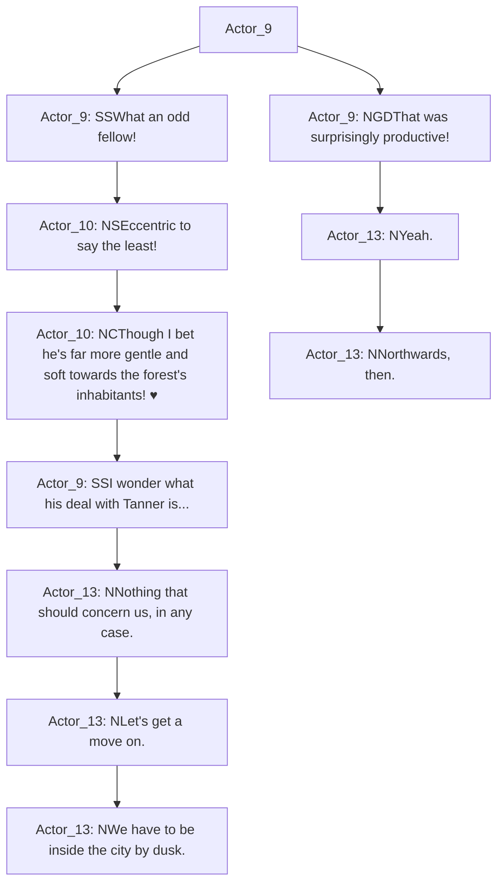

# Trachi/Outskirts/EV010

```mermaid
graph TD
    626_0["Actor_9"]
    626_1["Actor_9: SSWhat an odd fellow!"]
    626_2["Actor_10: NSEccentric to say the least!"]
    626_3["Actor_10: NCThough I bet he's far more gentle and soft towards the forest's inhabitants! ♥"]
    626_4["Actor_9: SSI wonder what his deal with Tanner is..."]
    626_5["Actor_13: NNothing that should concern us, in any case."]
    626_6["Actor_13: NLet's get a move on."]
    626_7["Actor_13: NWe have to be inside the city by dusk."]
    626_8["Actor_9: NGDThat was surprisingly productive!"]
    626_9["Actor_13: NYeah."]
    626_10["Actor_13: NNorthwards, then."]
    626_0 --> 626_1
    626_0 --> 626_8
    626_1 --> 626_2
    626_2 --> 626_3
    626_3 --> 626_4
    626_4 --> 626_5
    626_5 --> 626_6
    626_6 --> 626_7
    626_8 --> 626_9
    626_9 --> 626_10
```