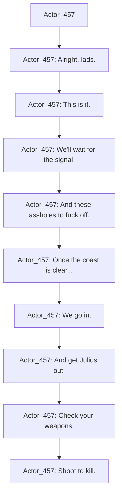

# Trachi/Outskirts/EV024

```mermaid
graph TD
    628_0["Actor_457"]
    628_1["Actor_457: Alright, lads."]
    628_2["Actor_457: This is it."]
    628_3["Actor_457: We'll wait for the signal."]
    628_4["Actor_457: And these assholes to fuck off."]
    628_5["Actor_457: Once the coast is clear..."]
    628_6["Actor_457: We go in."]
    628_7["Actor_457: And get Julius out."]
    628_8["Actor_457: Check your weapons."]
    628_9["Actor_457: Shoot to kill."]
    628_0 --> 628_1
    628_1 --> 628_2
    628_2 --> 628_3
    628_3 --> 628_4
    628_4 --> 628_5
    628_5 --> 628_6
    628_6 --> 628_7
    628_7 --> 628_8
    628_8 --> 628_9
```