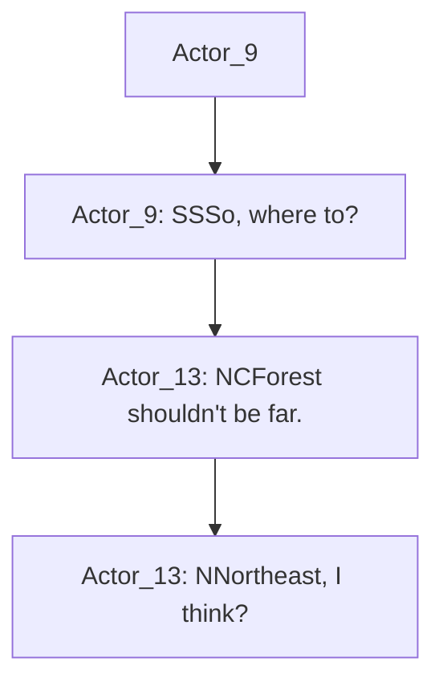

# Trachi/Outskirts/Intro Forest

```mermaid
graph TD
    629_0["Actor_9"]
    629_1["Actor_9: SSSo, where to?"]
    629_2["Actor_13: NCForest shouldn't be far."]
    629_3["Actor_13: NNortheast, I think?"]
    629_0 --> 629_1
    629_1 --> 629_2
    629_2 --> 629_3
```