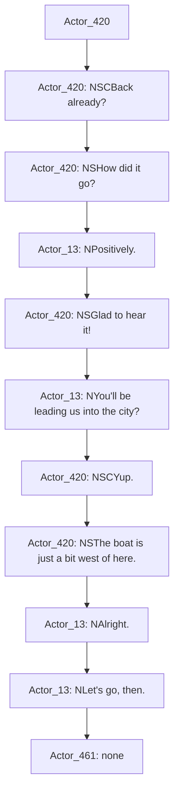

# Trachi/Outskirts/Randolph Trail/EV005

```mermaid
graph TD
    633_0["Actor_420"]
    633_1["Actor_420: NSCBack already?"]
    633_2["Actor_420: NSHow did it go?"]
    633_3["Actor_13: NPositively."]
    633_4["Actor_420: NSGlad to hear it!"]
    633_5["Actor_13: NYou'll be leading us into the city?"]
    633_6["Actor_420: NSCYup."]
    633_7["Actor_420: NSThe boat is just a bit west of here."]
    633_8["Actor_13: NAlright."]
    633_9["Actor_13: NLet's go, then."]
    633_10["Actor_461: none"]
    633_0 --> 633_1
    633_1 --> 633_2
    633_2 --> 633_3
    633_3 --> 633_4
    633_4 --> 633_5
    633_5 --> 633_6
    633_6 --> 633_7
    633_7 --> 633_8
    633_8 --> 633_9
    633_9 --> 633_10
```