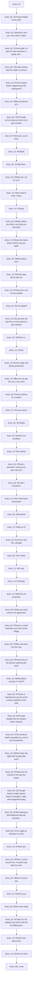

# Trachi/Outskirts/Randolph Trail/Nestville/Council Reception/Council Hall/EV007

```mermaid
graph TD
    636_0["Actor_62"]
    636_1["Actor_62: SCI'll get straight to the point."]
    636_2["Actor_62: NHeinrich sent you, from what I heard."]
    636_3["Actor_62: SCAnd while I'm glad he had someone to speak with..."]
    636_4["Actor_62: SSIt also means that the matter is serious."]
    636_5["Actor_13: NYou've heard what's happening at the checkpoint?"]
    636_6["Actor_62: NBits and pieces of it."]
    636_7["Actor_62: SSCThough we're trying our best not to get involved."]
    636_8["Actor_62: NAnd yet, you're here."]
    636_9["Actor_13: NCRight."]
    636_10["Actor_62: SCWell then..."]
    636_11["Actor_62: NWhat can I do for you?"]
    636_12["Actor_13: NWe need to enter Trachi."]
    636_13["Actor_13: NToday."]
    636_14["Actor_62: NWhat makes you think I can help you with that?"]
    636_15["Actor_13: NDoes the name Julius Gaston ring any bells?"]
    636_16["Actor_62: NWhat about him?"]
    636_17["Actor_13: NCDon't play dumb with me."]
    636_18["Actor_13: NI know he's one of your people."]
    636_19["Actor_62: NIs he alright?"]
    636_20["Actor_13: NCLast time we saw him, he was about to get maimed."]
    636_21["Actor_62: SCDamn it..."]
    636_22["Actor_13: NYeah."]
    636_23["Actor_13: NCHe's likely still being questioned."]
    636_24["Actor_13: NBut we can get him out, if you want."]
    636_25["Actor_62: NYou're asking for a trade?"]
    636_26["Actor_13: NAs you said it."]
    636_27["Actor_62: SCAlright."]
    636_28["Actor_62: NUnder one condition."]
    636_29["Actor_13: NGo ahead."]
    636_30["Actor_62: NThere's someone I want you to take with you."]
    636_31["Actor_62: SCCall it insurance."]
    636_32["Actor_13: NYou think that's necessary?"]
    636_33["Actor_62: NEssential."]
    636_34["Actor_13: NWho is it?"]
    636_35["Actor_62: SCYou've met him, already."]
    636_36["Actor_62: NIt's Tillian."]
    636_37["Actor_13: NCI see."]
    636_38["Actor_13: NCAlright."]
    636_39["Actor_13: NWe'll do as proposed."]
    636_40["Actor_62: NGlad we could come to an agreement."]
    636_41["Actor_62: NThere's a small waterway, just west of this village."]
    636_42["Actor_62: NTillian will show you the way."]
    636_43["Actor_62: NPresent this to the person watching the boat."]
    636_44["Actor_13: NWhat about security in Trachi?"]
    636_45["Actor_62: NThere's a maintenance access at the northern partition of the wall."]
    636_46["Actor_62: SCIt leads straight into the eastern sewer network."]
    636_47["Actor_62: NThe entrance itself is guarded by a set of two Guardsmen."]
    636_48["Actor_13: NWhen does the night shift usually take over?"]
    636_49["Actor_62: NThese are the records of the last two weeks."]
    636_50["Actor_62: SCThough there's a high chance they've changed it, after what happened today."]
    636_51["Actor_62: SCBut seeing as that likelihood will only increase..."]
    636_52["Actor_62: NYou might as well give it a shot."]
    636_53["Actor_13: NThank you."]
    636_54["Actor_62: SCNow, if you'll excuse me, I've got to get back to work."]
    636_55["Actor_62: NBest of luck to you."]
    636_56["Actor_13: NAnd to you."]
    636_57["Actor_62: NOne more thing."]
    636_58["Actor_62: NI hope I'm not adding more fuel to the fire by helping you."]
    636_59["Actor_13: NCWe'll see about that."]
    636_60["Actor_13: NUntil next time."]
    636_61["Actor_461: none"]
    636_0 --> 636_1
    636_1 --> 636_2
    636_2 --> 636_3
    636_3 --> 636_4
    636_4 --> 636_5
    636_5 --> 636_6
    636_6 --> 636_7
    636_7 --> 636_8
    636_8 --> 636_9
    636_9 --> 636_10
    636_10 --> 636_11
    636_11 --> 636_12
    636_12 --> 636_13
    636_13 --> 636_14
    636_14 --> 636_15
    636_15 --> 636_16
    636_16 --> 636_17
    636_17 --> 636_18
    636_18 --> 636_19
    636_19 --> 636_20
    636_20 --> 636_21
    636_21 --> 636_22
    636_22 --> 636_23
    636_23 --> 636_24
    636_24 --> 636_25
    636_25 --> 636_26
    636_26 --> 636_27
    636_27 --> 636_28
    636_28 --> 636_29
    636_29 --> 636_30
    636_30 --> 636_31
    636_31 --> 636_32
    636_32 --> 636_33
    636_33 --> 636_34
    636_34 --> 636_35
    636_35 --> 636_36
    636_36 --> 636_37
    636_37 --> 636_38
    636_38 --> 636_39
    636_39 --> 636_40
    636_40 --> 636_41
    636_41 --> 636_42
    636_42 --> 636_43
    636_43 --> 636_44
    636_44 --> 636_45
    636_45 --> 636_46
    636_46 --> 636_47
    636_47 --> 636_48
    636_48 --> 636_49
    636_49 --> 636_50
    636_50 --> 636_51
    636_51 --> 636_52
    636_52 --> 636_53
    636_53 --> 636_54
    636_54 --> 636_55
    636_55 --> 636_56
    636_56 --> 636_57
    636_57 --> 636_58
    636_58 --> 636_59
    636_59 --> 636_60
    636_60 --> 636_61
```