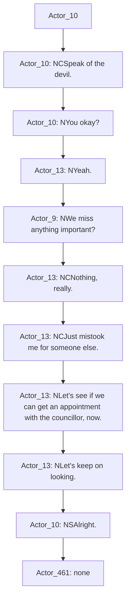

# Trachi/Outskirts/Randolph Trail/Nestville/Daphne After Dinner

```mermaid
graph TD
    638_0["Actor_10"]
    638_1["Actor_10: NCSpeak of the devil."]
    638_2["Actor_10: NYou okay?"]
    638_3["Actor_13: NYeah."]
    638_4["Actor_9: NWe miss anything important?"]
    638_5["Actor_13: NCNothing, really."]
    638_6["Actor_13: NCJust mistook me for someone else."]
    638_7["Actor_13: NLet's see if we can get an appointment with the councillor, now."]
    638_8["Actor_13: NLet's keep on looking."]
    638_9["Actor_10: NSAlright."]
    638_10["Actor_461: none"]
    638_0 --> 638_1
    638_1 --> 638_2
    638_2 --> 638_3
    638_3 --> 638_4
    638_4 --> 638_5
    638_5 --> 638_6
    638_6 --> 638_7
    638_7 --> 638_8
    638_8 --> 638_9
    638_9 --> 638_10
```