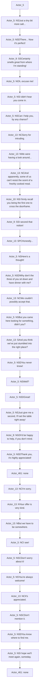

# Trachi/Outskirts/Randolph Trail/Nestville/De Bloom House/Entry

```mermaid
graph TD
    641_0["Actor_5"]
    641_1["Actor_5: NSJust a tiny bit more salt..."]
    641_2["Actor_5: NSDThere... Now it's perfect!"]
    641_3["Actor_9: SSCertainly smells great from where I'm standing!"]
    641_4["Actor_5: NOh, excuse me!"]
    641_5["Actor_5: NSI didn't hear you come in."]
    641_6["Actor_5: NSCan I help you, by any chance?"]
    641_7["Actor_13: NCSorry for intruding."]
    641_8["Actor_13: NWe were having a look around..."]
    641_9["Actor_13: NCAnd apparently, some of us can't resist the scent of a freshly cooked meal."]
    641_10["Actor_10: NSI firmly recall you being the first one to cross the doorframe."]
    641_11["Actor_9: SSI second that notion!"]
    641_12["Actor_13: SPCHonestly..."]
    641_13["Actor_5: NSHere's a thought!"]
    641_14["Actor_5: NSDWhy don't the three of you sit down and have dinner with me?"]
    641_15["Actor_13: NCWe couldn't possibly accept that."]
    641_16["Actor_5: NSBut you came here looking for something, didn't you?"]
    641_17["Actor_13: SAnd you think we've just stumbled into the right place?"]
    641_18["Actor_5: NSDYou never know!"]
    641_19["Actor_5: NSWell?"]
    641_20["Actor_5: NSDGreat!"]
    641_21["Actor_5: NSJust give me a second, I'll set the table right away!"]
    641_22["Actor_9: NGDI'd be happy to help, if you don't mind."]
    641_23["Actor_5: NSDThank you, it's highly appreciated!"]
    641_24["Actor_461: none"]
    641_25["Actor_13: NCI'm sorry."]
    641_26["Actor_13: NYour offer is very kind."]
    641_27["Actor_13: NBut we have to be somewhere."]
    641_28["Actor_5: NCI see!"]
    641_29["Actor_5: NSCDon't worry about it!"]
    641_30["Actor_5: NSYou're always welcome!"]
    641_31["Actor_13: NCIt's appreciated."]
    641_32["Actor_5: NSCDon't mention it."]
    641_33["Actor_5: NSDYou know where to find me."]
    641_34["Actor_5: NSI hope we'll meet again, someday."]
    641_35["Actor_461: none"]
    641_0 --> 641_1
    641_1 --> 641_2
    641_2 --> 641_3
    641_3 --> 641_4
    641_4 --> 641_5
    641_5 --> 641_6
    641_6 --> 641_7
    641_7 --> 641_8
    641_8 --> 641_9
    641_9 --> 641_10
    641_10 --> 641_11
    641_11 --> 641_12
    641_12 --> 641_13
    641_13 --> 641_14
    641_14 --> 641_15
    641_15 --> 641_16
    641_16 --> 641_17
    641_17 --> 641_18
    641_18 --> 641_19
    641_19 --> 641_20
    641_20 --> 641_21
    641_21 --> 641_22
    641_22 --> 641_23
    641_23 --> 641_24
    641_24 --> 641_25
    641_25 --> 641_26
    641_26 --> 641_27
    641_27 --> 641_28
    641_28 --> 641_29
    641_29 --> 641_30
    641_30 --> 641_31
    641_31 --> 641_32
    641_32 --> 641_33
    641_33 --> 641_34
    641_34 --> 641_35
```