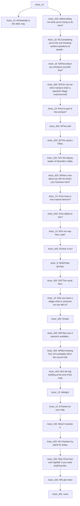

# Trachi/Outskirts/Randolph Trail/Tillian Entrance

```mermaid
graph TD
    666_0["Actor_13"]
    666_1["Actor_13: NCNestville is the other way."]
    666_2["Actor_420: SMind telling me what you're trying to do here?"]
    666_3["Actor_10: NCConsidering you're the one throwing random questions at people..."]
    666_4["Actor_10: NSHow about you introduce yourself, first?"]
    666_5["Actor_420: SPCIt's not me who's trying to enter a peaceful village unannounced!"]
    666_6["Actor_13: NYou're part of this enclave?"]
    666_7["Actor_420: SPYou bet!"]
    666_8["Actor_420: SCThe name's Tillian."]
    666_9["Actor_420: SI'm the deputy leader of Nestville's militia."]
    666_10["Actor_420: SPNow, how about you tell me what's your business here?"]
    666_11["Actor_13: NYou know a man named Heinrich?"]
    666_12["Actor_420: SYou talked to him?"]
    666_13["Actor_13: NOn our way here, yeah."]
    666_14["Actor_420: SCHow is he?"]
    666_15["Actor_9: NGDPretty grumpy."]
    666_16["Actor_420: SPCThe usual, then."]
    666_17["Actor_13: NDo you have a village chief or someone we can talk to?"]
    666_18["Actor_420: NYeah."]
    666_19["Actor_420: NPCNot sure if anyone's available..."]
    666_20["Actor_420: NPBut knowing Kris, he's probably still in the council hall."]
    666_21["Actor_420: NIt's the big building at the end of the road."]
    666_22["Actor_13: NAlright."]
    666_23["Actor_13: NThanks for your help."]
    666_24["Actor_420: NDon't mention it."]
    666_25["Actor_420: NCI finished my patrol for today."]
    666_26["Actor_420: NSo I'll be here until nightfall, if you need anything else."]
    666_27["Actor_420: NPLater then!"]
    666_28["Actor_461: none"]
    666_0 --> 666_1
    666_0 --> 666_2
    666_2 --> 666_3
    666_3 --> 666_4
    666_4 --> 666_5
    666_5 --> 666_6
    666_6 --> 666_7
    666_7 --> 666_8
    666_8 --> 666_9
    666_9 --> 666_10
    666_10 --> 666_11
    666_11 --> 666_12
    666_12 --> 666_13
    666_13 --> 666_14
    666_14 --> 666_15
    666_15 --> 666_16
    666_16 --> 666_17
    666_17 --> 666_18
    666_18 --> 666_19
    666_19 --> 666_20
    666_20 --> 666_21
    666_21 --> 666_22
    666_22 --> 666_23
    666_23 --> 666_24
    666_24 --> 666_25
    666_25 --> 666_26
    666_26 --> 666_27
    666_27 --> 666_28
```