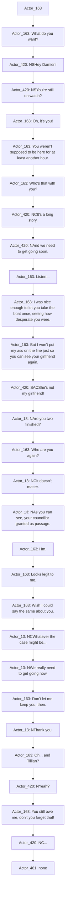

# Trachi/Outskirts/Randolph Trail/Waterway/Boatwatcher

```mermaid
graph TD
    667_0["Actor_163"]
    667_1["Actor_163: What do you want?"]
    667_2["Actor_420: NSHey Damien!"]
    667_3["Actor_420: NSYou're still on watch?"]
    667_4["Actor_163: Oh, it's you!"]
    667_5["Actor_163: You weren't supposed to be here for at least another hour."]
    667_6["Actor_163: Who's that with you?"]
    667_7["Actor_420: NCIt's a long story."]
    667_8["Actor_420: NAnd we need to get going soon."]
    667_9["Actor_163: Listen..."]
    667_10["Actor_163: I was nice enough to let you take the boat once, seeing how desperate you were."]
    667_11["Actor_163: But I won't put my ass on the line just so you can see your girlfriend again."]
    667_12["Actor_420: SACShe's not my girlfriend!"]
    667_13["Actor_13: NAre you two finished?"]
    667_14["Actor_163: Who are you again?"]
    667_15["Actor_13: NCIt doesn't matter."]
    667_16["Actor_13: NAs you can see, your councillor granted us passage."]
    667_17["Actor_163: Hm."]
    667_18["Actor_163: Looks legit to me."]
    667_19["Actor_163: Wish I could say the same about you."]
    667_20["Actor_13: NCWhatever the case might be..."]
    667_21["Actor_13: NWe really need to get going now."]
    667_22["Actor_163: Don't let me keep you, then."]
    667_23["Actor_13: NThank you."]
    667_24["Actor_163: Oh... and Tillian?"]
    667_25["Actor_420: NYeah?"]
    667_26["Actor_163: You still owe me, don't you forget that!"]
    667_27["Actor_420: NC..."]
    667_28["Actor_461: none"]
    667_0 --> 667_1
    667_1 --> 667_2
    667_2 --> 667_3
    667_3 --> 667_4
    667_4 --> 667_5
    667_5 --> 667_6
    667_6 --> 667_7
    667_7 --> 667_8
    667_8 --> 667_9
    667_9 --> 667_10
    667_10 --> 667_11
    667_11 --> 667_12
    667_12 --> 667_13
    667_13 --> 667_14
    667_14 --> 667_15
    667_15 --> 667_16
    667_16 --> 667_17
    667_17 --> 667_18
    667_18 --> 667_19
    667_19 --> 667_20
    667_20 --> 667_21
    667_21 --> 667_22
    667_22 --> 667_23
    667_23 --> 667_24
    667_24 --> 667_25
    667_25 --> 667_26
    667_26 --> 667_27
    667_27 --> 667_28
```