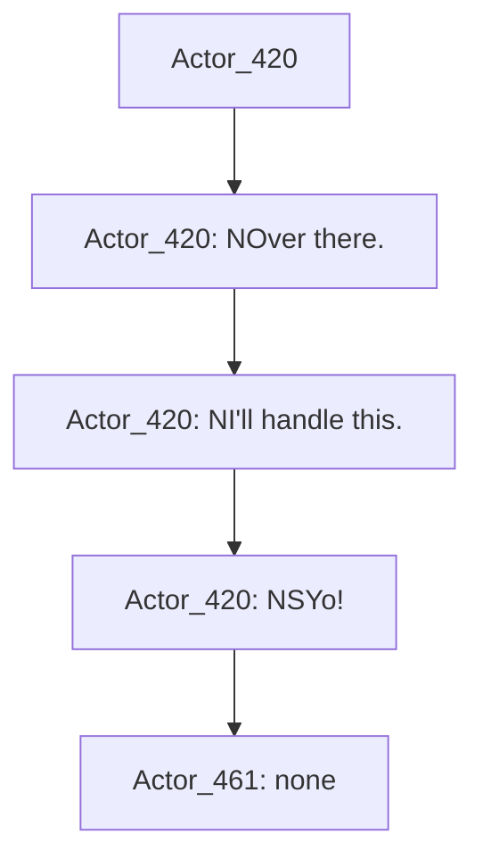

# Trachi/Outskirts/Randolph Trail/Waterway/EV002

```mermaid
graph TD
    668_0["Actor_420"]
    668_1["Actor_420: NOver there."]
    668_2["Actor_420: NI'll handle this."]
    668_3["Actor_420: NSYo!"]
    668_4["Actor_461: none"]
    668_0 --> 668_1
    668_1 --> 668_2
    668_2 --> 668_3
    668_3 --> 668_4
```