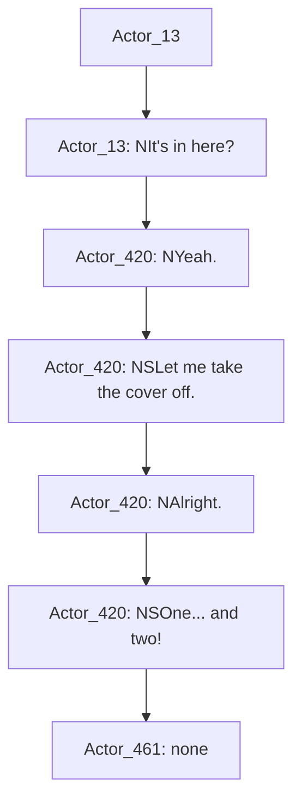

# Trachi/Outskirts/Randolph Trail/Waterway/EV003

```mermaid
graph TD
    669_0["Actor_13"]
    669_1["Actor_13: NIt's in here?"]
    669_2["Actor_420: NYeah."]
    669_3["Actor_420: NSLet me take the cover off."]
    669_4["Actor_420: NAlright."]
    669_5["Actor_420: NSOne... and two!"]
    669_6["Actor_461: none"]
    669_0 --> 669_1
    669_1 --> 669_2
    669_2 --> 669_3
    669_3 --> 669_4
    669_4 --> 669_5
    669_5 --> 669_6
```