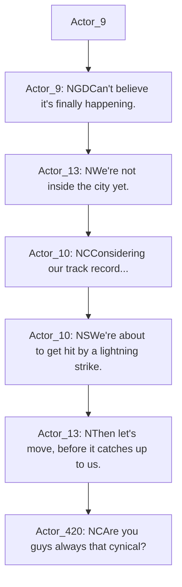

# Trachi/Outskirts/Randolph Trail/Waterway/EV004

```mermaid
graph TD
    670_0["Actor_9"]
    670_1["Actor_9: NGDCan't believe it's finally happening."]
    670_2["Actor_13: NWe're not inside the city yet."]
    670_3["Actor_10: NCConsidering our track record..."]
    670_4["Actor_10: NSWe're about to get hit by a lightning strike."]
    670_5["Actor_13: NThen let's move, before it catches up to us."]
    670_6["Actor_420: NCAre you guys always that cynical?"]
    670_0 --> 670_1
    670_1 --> 670_2
    670_2 --> 670_3
    670_3 --> 670_4
    670_4 --> 670_5
    670_5 --> 670_6
```