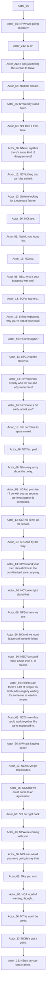

# Trachi/Outskirts/Woods/Glade/EV003

```mermaid
graph TD
    671_0["Actor_66"]
    671_1["Actor_66: NPWhat's going on here!?"]
    671_2["Actor_212: S-sir!"]
    671_3["Actor_212: I was just telling this civilian to leave."]
    671_4["Actor_66: NCThat I heard."]
    671_5["Actor_66: NYou may stand down."]
    671_6["Actor_66: NI'll take it from here."]
    671_7["Actor_66: NNow, I gather there's some kind of disagreement?"]
    671_8["Actor_13: NCNothing that can't be solved."]
    671_9["Actor_13: SWe're looking for Lieutenant Tanner."]
    671_10["Actor_66: NCI see."]
    671_11["Actor_66: NWell, you found him."]
    671_12["Actor_13: NGood."]
    671_13["Actor_66: NSo, what's your business with me?"]
    671_14["Actor_13: SCFor starters..."]
    671_15["Actor_13: SMind explaining why you're not at your post?"]
    671_16["Actor_66: NCome again?"]
    671_17["Actor_13: SPCDrop the pretense."]
    671_18["Actor_13: SPYou know exactly who we are and why we're here!"]
    671_19["Actor_66: NCYou're a bit early, aren't you?"]
    671_20["Actor_13: SPI don't like to repeat myself."]
    671_21["Actor_66: NCYes, yes!"]
    671_22["Actor_66: NI'm very sorry about the delay."]
    671_23["Actor_66: NCAnd promise I'll be with you as soon as our investigation is concluded."]
    671_24["Actor_13: SCThis is not up for debate."]
    671_25["Actor_13: SPCAnd by the way:"]
    671_26["Actor_13: SPYou and your men shouldn't be in the demilitarized zone, anyway."]
    671_27["Actor_66: NCYou're right about that."]
    671_28["Actor_66: NPBut here we are."]
    671_29["Actor_66: NCAnd we won't leave until we're finished."]
    671_30["Actor_66: NECYou could make a fuss over it, of course."]
    671_31["Actor_66: NEI'm sure there's a lot of people on both sides eagerly waiting for someone to lose his temper."]
    671_32["Actor_66: NCOr two of us could work together like we're supposed to."]
    671_33["Actor_66: NWhat's it going to be?"]
    671_34["Actor_13: NCYou've got ten minutes."]
    671_35["Actor_66: NCGlad we could come to an agreement."]
    671_36["Actor_66: NI'll be right back."]
    671_37["Actor_13: SPWe're coming with you."]
    671_38["Actor_66: NCI was afraid you were going to say that."]
    671_39["Actor_66: NAs you wish."]
    671_40["Actor_66: NCA word of warning, though..."]
    671_41["Actor_66: NThis won't be pretty."]
    671_42["Actor_13: NCHe's got a point."]
    671_43["Actor_13: NStay on your toes in there."]
    671_0 --> 671_1
    671_1 --> 671_2
    671_2 --> 671_3
    671_3 --> 671_4
    671_4 --> 671_5
    671_5 --> 671_6
    671_6 --> 671_7
    671_7 --> 671_8
    671_8 --> 671_9
    671_9 --> 671_10
    671_10 --> 671_11
    671_11 --> 671_12
    671_12 --> 671_13
    671_13 --> 671_14
    671_14 --> 671_15
    671_15 --> 671_16
    671_16 --> 671_17
    671_17 --> 671_18
    671_18 --> 671_19
    671_19 --> 671_20
    671_20 --> 671_21
    671_21 --> 671_22
    671_22 --> 671_23
    671_23 --> 671_24
    671_24 --> 671_25
    671_25 --> 671_26
    671_26 --> 671_27
    671_27 --> 671_28
    671_28 --> 671_29
    671_29 --> 671_30
    671_30 --> 671_31
    671_31 --> 671_32
    671_32 --> 671_33
    671_33 --> 671_34
    671_34 --> 671_35
    671_35 --> 671_36
    671_36 --> 671_37
    671_37 --> 671_38
    671_38 --> 671_39
    671_39 --> 671_40
    671_40 --> 671_41
    671_41 --> 671_42
    671_42 --> 671_43
```