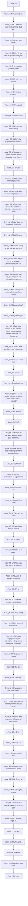

# Trachi/Outskirts/Woods/Glade/Refuge/EV001

```mermaid
graph TD
    673_0["Actor_66"]
    673_1["Actor_66: NWelcome back."]
    673_2["Actor_66: NCLet's start from the beginning, shall we?"]
    673_3["Actor_66: NWhat's your name?"]
    673_4["Actor_65: SCWhy do we have to go over this again?"]
    673_5["Actor_65: SI already told you everything!"]
    673_6["Actor_66: NEI ask, you answer!"]
    673_7["Actor_65: SPCJulius Gaston..."]
    673_8["Actor_66: NCVery good!"]
    673_9["Actor_66: NPProfession?"]
    673_10["Actor_65: SCWorking the docks, mostly."]
    673_11["Actor_66: NWhat's the purpose of this hideout?"]
    673_12["Actor_65: SCKeeping our heads dry until we're cleared to enter Trachi."]
    673_13["Actor_66: NPLiar!"]
    673_14["Actor_65: SPCHit me as much as you want."]
    673_15["Actor_65: SAt some point, it's all coming back to you."]
    673_16["Actor_65: SEYou think Heinrich would have tolerated behaviour like that?"]
    673_17["Actor_66: NEHow dare you lecture me on morals!"]
    673_18["Actor_66: NCBut I digress..."]
    673_19["Actor_66: NNow, I'm going to ask you one last time:"]
    673_20["Actor_66: NPDid or did you not try to smuggle contraband into the city?"]
    673_21["Actor_65: SAs you can see, our things are not being taken anywhere."]
    673_22["Actor_66: NSo what's your business hiding out here, then?"]
    673_23["Actor_65: SPAre you deaf?"]
    673_24["Actor_65: SCI just told you."]
    673_25["Actor_65: SPWe were waiting for the customs officer to approve our request, then you lot showed up."]
    673_26["Actor_66: NCThen I hope you don't mind me asking..."]
    673_27["Actor_66: NCan you proof that?"]
    673_28["Actor_65: SHuh?"]
    673_29["Actor_66: NCYou heard me."]
    673_30["Actor_65: SCHow about you go ask your people at the custom's office, instead?"]
    673_31["Actor_66: NCWe did."]
    673_32["Actor_65: SSo?"]
    673_33["Actor_66: NCNone of the staff were able to confirm your statement."]
    673_34["Actor_66: NAnd neither was there any record of your application."]
    673_35["Actor_65: SEWhat!?"]
    673_36["Actor_66: NCYour confusion is as big as mine."]
    673_37["Actor_66: NCCome on, Julius."]
    673_38["Actor_66: NOut with the truth!"]
    673_39["Actor_65: SCThis can't be right!"]
    673_40["Actor_65: SPI was there, and you know it!"]
    673_41["Actor_66: NCI wish."]
    673_42["Actor_66: NPCBut as it stands..."]
    673_43["Actor_66: NPThis is your last chance to confess!"]
    673_44["Actor_66: NEAdmit it already, you scum!"]
    673_45["Actor_65: SANo!"]
    673_46["Actor_66: NCYou know, I always respected you."]
    673_47["Actor_66: NIt's a pity, really."]
    673_48["Actor_66: NPCBy power of Parliament..."]
    673_49["Actor_66: NPI hereby judge you guilty of attempting a large-scale smuggling operation."]
    673_50["Actor_66: NPCorporal, the cleaver!"]
    673_51["Actor_104: Aye Sir!"]
    673_52["Actor_9: SPCSeriously?"]
    673_53["Actor_66: NPSomething you want to say?"]
    673_54["Actor_9: SPIs that how you handle problems around here?"]
    673_55["Actor_66: NAm I to take this as an official act of intervention?"]
    673_56["Actor_13: NCNo."]
    673_57["Actor_13: NCarry on."]
    673_58["Actor_9: SYou're ok with this?"]
    673_59["Actor_13: NCMy personal opinion doesn't matter."]
    673_60["Actor_13: NWe should go."]
    673_61["Actor_66: NCMy thoughts, exactly."]
    673_62["Actor_66: NI'll be back at the checkpoint as soon as I can."]
    673_63["Actor_13: NCI certainly hope so."]
    673_64["Actor_13: SIf not..."]
    673_65["Actor_66: NCYes, yes..."]
    673_66["Actor_66: NI know."]
    673_67["Actor_13: SPWe'll see you there."]
    673_68["Actor_461: none"]
    673_0 --> 673_1
    673_1 --> 673_2
    673_2 --> 673_3
    673_3 --> 673_4
    673_4 --> 673_5
    673_5 --> 673_6
    673_6 --> 673_7
    673_7 --> 673_8
    673_8 --> 673_9
    673_9 --> 673_10
    673_10 --> 673_11
    673_11 --> 673_12
    673_12 --> 673_13
    673_13 --> 673_14
    673_14 --> 673_15
    673_15 --> 673_16
    673_16 --> 673_17
    673_17 --> 673_18
    673_18 --> 673_19
    673_19 --> 673_20
    673_20 --> 673_21
    673_21 --> 673_22
    673_22 --> 673_23
    673_23 --> 673_24
    673_24 --> 673_25
    673_25 --> 673_26
    673_26 --> 673_27
    673_27 --> 673_28
    673_28 --> 673_29
    673_29 --> 673_30
    673_30 --> 673_31
    673_31 --> 673_32
    673_32 --> 673_33
    673_33 --> 673_34
    673_34 --> 673_35
    673_35 --> 673_36
    673_36 --> 673_37
    673_37 --> 673_38
    673_38 --> 673_39
    673_39 --> 673_40
    673_40 --> 673_41
    673_41 --> 673_42
    673_42 --> 673_43
    673_43 --> 673_44
    673_44 --> 673_45
    673_45 --> 673_46
    673_46 --> 673_47
    673_47 --> 673_48
    673_48 --> 673_49
    673_49 --> 673_50
    673_50 --> 673_51
    673_51 --> 673_52
    673_52 --> 673_53
    673_53 --> 673_54
    673_54 --> 673_55
    673_55 --> 673_56
    673_56 --> 673_57
    673_57 --> 673_58
    673_58 --> 673_59
    673_59 --> 673_60
    673_60 --> 673_61
    673_61 --> 673_62
    673_62 --> 673_63
    673_63 --> 673_64
    673_64 --> 673_65
    673_65 --> 673_66
    673_66 --> 673_67
    673_67 --> 673_68
```