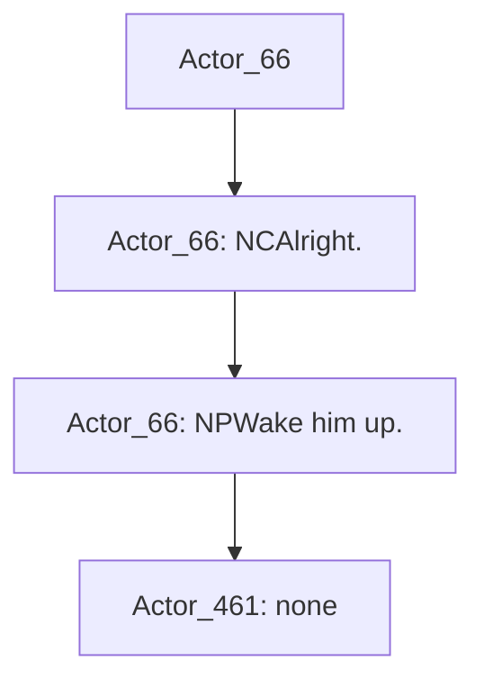

# Trachi/Outskirts/Woods/Glade/Refuge/EV009

```mermaid
graph TD
    675_0["Actor_66"]
    675_1["Actor_66: NCAlright."]
    675_2["Actor_66: NPWake him up."]
    675_3["Actor_461: none"]
    675_0 --> 675_1
    675_1 --> 675_2
    675_2 --> 675_3
```