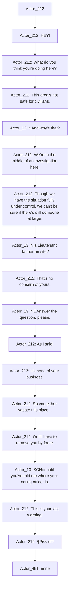

# Trachi/Outskirts/Woods/Glade/Soldier Glade

```mermaid
graph TD
    679_0["Actor_212"]
    679_1["Actor_212: HEY!"]
    679_2["Actor_212: What do you think you're doing here?"]
    679_3["Actor_212: This area's not safe for civilians."]
    679_4["Actor_13: NAnd why's that?"]
    679_5["Actor_212: We're in the middle of an investigation here."]
    679_6["Actor_212: Though we have the situation fully under control, we can't be sure if there's still someone at large."]
    679_7["Actor_13: NIs Lieutenant Tanner on site?"]
    679_8["Actor_212: That's no concern of yours."]
    679_9["Actor_13: NCAnswer the question, please."]
    679_10["Actor_212: As I said."]
    679_11["Actor_212: It's none of your business."]
    679_12["Actor_212: So you either vacate this place..."]
    679_13["Actor_212: Or I'll have to remove you by force."]
    679_14["Actor_13: SCNot until you've told me where your acting officer is."]
    679_15["Actor_212: This is your last warning!"]
    679_16["Actor_212: \{Piss off!"]
    679_17["Actor_461: none"]
    679_0 --> 679_1
    679_1 --> 679_2
    679_2 --> 679_3
    679_3 --> 679_4
    679_4 --> 679_5
    679_5 --> 679_6
    679_6 --> 679_7
    679_7 --> 679_8
    679_8 --> 679_9
    679_9 --> 679_10
    679_10 --> 679_11
    679_11 --> 679_12
    679_12 --> 679_13
    679_13 --> 679_14
    679_14 --> 679_15
    679_15 --> 679_16
    679_16 --> 679_17
```