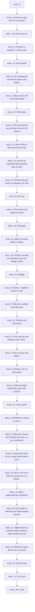

# Trachi/Outskirts/Woods/Tint post Interrogation

```mermaid
graph TD
    680_0["Actor_9"]
    680_1["Actor_9: SCan we stop here for a second?"]
    680_2["Actor_13: NIf we have to."]
    680_3["Actor_9: SThere's a question I want to ask."]
    680_4["Actor_13: NGo ahead."]
    680_5["Actor_9: NCI understand we have to keep a low profile."]
    680_6["Actor_9: SBut we are still in the DMZ right?"]
    680_7["Actor_13: NCCorrect."]
    680_8["Actor_9: SSo why let this guy act like he owns the place?"]
    680_9["Actor_13: NHe's still our best lead into the city."]
    680_10["Actor_13: NCAnd an important figure beyond that, as well."]
    680_11["Actor_13: NThat's why we have to cooperate, for now."]
    680_12["Actor_9: NCI see."]
    680_13["Actor_9: NYou think he'll keep his word?"]
    680_14["Actor_13: NCMaybe."]
    680_15["Actor_13: NBut he knows what's at stake."]
    680_16["Actor_13: SThat's not what you wanted to ask me, though, right?"]
    680_17["Actor_9: NCRight."]
    680_18["Actor_9: SCSee, I might be wrong on that."]
    680_19["Actor_9: SBut he's awfully well informed."]
    680_20["Actor_13: NCAnd well connected."]
    680_21["Actor_9: SThe way you two looked at each other..."]
    680_22["Actor_9: SAs if you've met before."]
    680_23["Actor_9: SCNow, I'm not gonna pry."]
    680_24["Actor_9: SBut he might exploit this, given the chance."]
    680_25["Actor_13: NYour point?"]
    680_26["Actor_9: NCWhat I'm trying to say is:"]
    680_27["Actor_9: NWe don't have a lot of friends out here, as you mentioned."]
    680_28["Actor_9: SSJust the three of us to watch each other's back."]
    680_29["Actor_13: NCI'm not sure if that's an assurance or a threat..."]
    680_30["Actor_13: NBut I appreciate the sentiment."]
    680_31["Actor_10: NCI'd hate to interrupt your little bonding session."]
    680_32["Actor_10: NSBut there's a custom's office I'd like to have another look at."]
    680_33["Actor_10: RGDIf you guys don't mind, of course!"]
    680_34["Actor_13: NGood idea."]
    680_35["Actor_13: SLet's go."]
    680_36["Actor_461: none"]
    680_0 --> 680_1
    680_1 --> 680_2
    680_2 --> 680_3
    680_3 --> 680_4
    680_4 --> 680_5
    680_5 --> 680_6
    680_6 --> 680_7
    680_7 --> 680_8
    680_8 --> 680_9
    680_9 --> 680_10
    680_10 --> 680_11
    680_11 --> 680_12
    680_12 --> 680_13
    680_13 --> 680_14
    680_14 --> 680_15
    680_15 --> 680_16
    680_16 --> 680_17
    680_17 --> 680_18
    680_18 --> 680_19
    680_19 --> 680_20
    680_20 --> 680_21
    680_21 --> 680_22
    680_22 --> 680_23
    680_23 --> 680_24
    680_24 --> 680_25
    680_25 --> 680_26
    680_26 --> 680_27
    680_27 --> 680_28
    680_28 --> 680_29
    680_29 --> 680_30
    680_30 --> 680_31
    680_31 --> 680_32
    680_32 --> 680_33
    680_33 --> 680_34
    680_34 --> 680_35
    680_35 --> 680_36
```