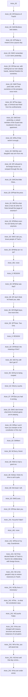

# Trachi/West/Anderson Park/EV006

```mermaid
graph TD
    685_0["Actor_63"]
    685_1["Actor_63: SPCitizens of Trachi!"]
    685_2["Actor_63: SWCBrothers and sisters."]
    685_3["Actor_63: SPToday is meant to be a joyous day."]
    685_4["Actor_63: SWCI remember it, as it were yesterday."]
    685_5["Actor_63: SPHow we, with nothing but our own steady hands, claimed freedom for ourselves."]
    685_6["Actor_63: SWCThree years later, we find ourselves on the precipice, once more."]
    685_7["Actor_63: SPTwo days ago, a criminal was freed from his confinements."]
    685_8["Actor_63: SWCAnd yesterday, a valued member of the Guard was murdered in his own apartment."]
    685_9["Actor_63: SPAs if that weren't enough..."]
    685_10["Actor_63: SWCMy own daughter was torn from me."]
    685_11["Actor_63: SPI refused to let foreign forces run rampant through this city."]
    685_12["Actor_63: SWCAnd little Clara..."]
    685_13["Actor_63: SPPaid the price."]
    685_14["Actor_63: SWCSo what does a man do when he finds himself the target of extortion?"]
    685_15["Actor_63: SPWhen even his own family isn't safe, anymore."]
    685_16["Actor_63: SWCI ask you, brave people of Trachi..."]
    685_17["Actor_63: SPWhat am I to do?"]
    685_18["Actor_461: none"]
    685_19["Actor_0: RESIGN!"]
    685_20["Actor_63: SPWhat was that?"]
    685_21["Actor_65: SPI don't think he heard you, lads."]
    685_22["Actor_65: SPCRight boys, one more time."]
    685_23["Actor_65: SPThree. Two. One."]
    685_24["Actor_0: RESIGN!"]
    685_25["Actor_63: SPWhat's the meaning of this?"]
    685_26["Actor_65: SSCYou still don't get it?"]
    685_27["Actor_65: SSYou're being couped."]
    685_28["Actor_62: NSorry Laurits."]
    685_29["Actor_67: SPCBut you had it coming."]
    685_30["Actor_63: SWCI don't know what kind of wicked game you're playing..."]
    685_31["Actor_63: SPBut I won't have you trample on the constitution of this city!"]
    685_32["Actor_63: SWMen!"]
    685_33["Actor_66: NCSorry, friend."]
    685_34["Actor_66: NWe've had a good run."]
    685_35["Actor_66: NCBut I think it's time to call it quits."]
    685_36["Actor_66: NAt least I will."]
    685_37["Actor_63: SWCLouis..."]
    685_38["Actor_63: SPHow dare you."]
    685_39["Actor_241: NLaurits Faber!"]
    685_40["Actor_461: none"]
    685_41["Actor_241: NPOut of my way, Guardsman."]
    685_42["Actor_241: NC'If the elected leader of Trachi is found to be collaborating with foreign forces..."]
    685_43["Actor_241: NIt is the people's duty to restore Autonomy to Trachi."]
    685_44["Actor_241: NCBy force, if necessary.'"]
    685_45["Actor_241: NThis... is what the constitution says."]
    685_46["Actor_241: NCLaurits Faber."]
    685_47["Actor_241: NYou are charged with treason, terrorism and several instances of corruption."]
    685_48["Actor_241: NFor this, you will stand trial."]
    685_49["Actor_241: NCAnd until that day comes..."]
    685_50["Actor_241: NYou are under arrest."]
    685_0 --> 685_1
    685_1 --> 685_2
    685_2 --> 685_3
    685_3 --> 685_4
    685_4 --> 685_5
    685_5 --> 685_6
    685_6 --> 685_7
    685_7 --> 685_8
    685_8 --> 685_9
    685_9 --> 685_10
    685_10 --> 685_11
    685_11 --> 685_12
    685_12 --> 685_13
    685_13 --> 685_14
    685_14 --> 685_15
    685_15 --> 685_16
    685_16 --> 685_17
    685_17 --> 685_18
    685_18 --> 685_19
    685_19 --> 685_20
    685_20 --> 685_21
    685_21 --> 685_22
    685_22 --> 685_23
    685_23 --> 685_24
    685_24 --> 685_25
    685_25 --> 685_26
    685_26 --> 685_27
    685_27 --> 685_28
    685_28 --> 685_29
    685_29 --> 685_30
    685_30 --> 685_31
    685_31 --> 685_32
    685_32 --> 685_33
    685_33 --> 685_34
    685_34 --> 685_35
    685_35 --> 685_36
    685_36 --> 685_37
    685_37 --> 685_38
    685_38 --> 685_39
    685_39 --> 685_40
    685_40 --> 685_41
    685_41 --> 685_42
    685_42 --> 685_43
    685_43 --> 685_44
    685_44 --> 685_45
    685_45 --> 685_46
    685_46 --> 685_47
    685_47 --> 685_48
    685_48 --> 685_49
    685_49 --> 685_50
```