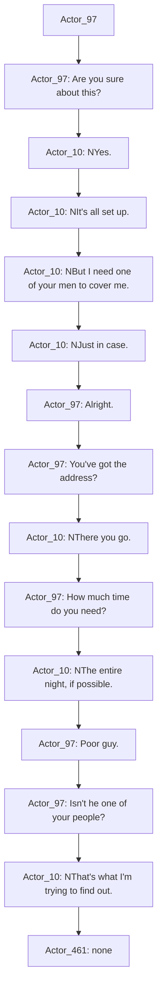

# Trachi/West/Anderson Park/EV016

```mermaid
graph TD
    689_0["Actor_97"]
    689_1["Actor_97: Are you sure about this?"]
    689_2["Actor_10: NYes."]
    689_3["Actor_10: NIt's all set up."]
    689_4["Actor_10: NBut I need one of your men to cover me."]
    689_5["Actor_10: NJust in case."]
    689_6["Actor_97: Alright."]
    689_7["Actor_97: You've got the address?"]
    689_8["Actor_10: NThere you go."]
    689_9["Actor_97: How much time do you need?"]
    689_10["Actor_10: NThe entire night, if possible."]
    689_11["Actor_97: Poor guy."]
    689_12["Actor_97: Isn't he one of your people?"]
    689_13["Actor_10: NThat's what I'm trying to find out."]
    689_14["Actor_461: none"]
    689_0 --> 689_1
    689_1 --> 689_2
    689_2 --> 689_3
    689_3 --> 689_4
    689_4 --> 689_5
    689_5 --> 689_6
    689_6 --> 689_7
    689_7 --> 689_8
    689_8 --> 689_9
    689_9 --> 689_10
    689_10 --> 689_11
    689_11 --> 689_12
    689_12 --> 689_13
    689_13 --> 689_14
```