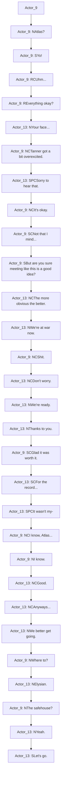

# Trachi/West/Anderson Park/EV029

```mermaid
graph TD
    691_0["Actor_9"]
    691_1["Actor_9: NAtlas?"]
    691_2["Actor_9: SYo!"]
    691_3["Actor_9: RCUhm..."]
    691_4["Actor_9: REverything okay?"]
    691_5["Actor_13: NYour face..."]
    691_6["Actor_9: NCTanner got a bit overexcited."]
    691_7["Actor_13: SPCSorry to hear that."]
    691_8["Actor_9: NCIt's okay."]
    691_9["Actor_9: SCNot that I mind..."]
    691_10["Actor_9: SBut are you sure meeting like this is a good idea?"]
    691_11["Actor_13: NCThe more obvious the better."]
    691_12["Actor_13: NWe're at war now."]
    691_13["Actor_9: NCShit."]
    691_14["Actor_13: NCDon't worry."]
    691_15["Actor_13: NWe're ready."]
    691_16["Actor_13: NThanks to you."]
    691_17["Actor_9: SCGlad it was worth it."]
    691_18["Actor_13: SCFor the record..."]
    691_19["Actor_13: SPCIt wasn't my-"]
    691_20["Actor_9: NCI know, Atlas..."]
    691_21["Actor_9: NI know."]
    691_22["Actor_13: NCGood."]
    691_23["Actor_13: NCAnyways..."]
    691_24["Actor_13: NWe better get going."]
    691_25["Actor_9: NWhere to?"]
    691_26["Actor_13: NElysian."]
    691_27["Actor_9: NThe safehouse?"]
    691_28["Actor_13: NYeah."]
    691_29["Actor_13: SLet's go."]
    691_0 --> 691_1
    691_1 --> 691_2
    691_2 --> 691_3
    691_3 --> 691_4
    691_4 --> 691_5
    691_5 --> 691_6
    691_6 --> 691_7
    691_7 --> 691_8
    691_8 --> 691_9
    691_9 --> 691_10
    691_10 --> 691_11
    691_11 --> 691_12
    691_12 --> 691_13
    691_13 --> 691_14
    691_14 --> 691_15
    691_15 --> 691_16
    691_16 --> 691_17
    691_17 --> 691_18
    691_18 --> 691_19
    691_19 --> 691_20
    691_20 --> 691_21
    691_21 --> 691_22
    691_22 --> 691_23
    691_23 --> 691_24
    691_24 --> 691_25
    691_25 --> 691_26
    691_26 --> 691_27
    691_27 --> 691_28
    691_28 --> 691_29
```