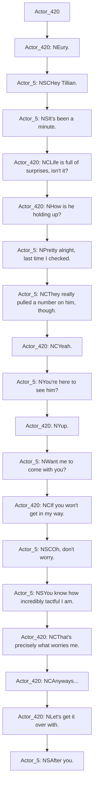

# Trachi/West/Farblein Trail/Farblein Apartments/EV004

```mermaid
graph TD
    699_0["Actor_420"]
    699_1["Actor_420: NEury."]
    699_2["Actor_5: NSCHey Tillian."]
    699_3["Actor_5: NSIt's been a minute."]
    699_4["Actor_420: NCLife is full of surprises, isn't it?"]
    699_5["Actor_420: NHow is he holding up?"]
    699_6["Actor_5: NPretty alright, last time I checked."]
    699_7["Actor_5: NCThey really pulled a number on him, though."]
    699_8["Actor_420: NCYeah."]
    699_9["Actor_5: NYou're here to see him?"]
    699_10["Actor_420: NYup."]
    699_11["Actor_5: NWant me to come with you?"]
    699_12["Actor_420: NCIf you won't get in my way."]
    699_13["Actor_5: NSCOh, don't worry."]
    699_14["Actor_5: NSYou know how incredibly tactful I am."]
    699_15["Actor_420: NCThat's precisely what worries me."]
    699_16["Actor_420: NCAnyways..."]
    699_17["Actor_420: NLet's get it over with."]
    699_18["Actor_5: NSAfter you."]
    699_0 --> 699_1
    699_1 --> 699_2
    699_2 --> 699_3
    699_3 --> 699_4
    699_4 --> 699_5
    699_5 --> 699_6
    699_6 --> 699_7
    699_7 --> 699_8
    699_8 --> 699_9
    699_9 --> 699_10
    699_10 --> 699_11
    699_11 --> 699_12
    699_12 --> 699_13
    699_13 --> 699_14
    699_14 --> 699_15
    699_15 --> 699_16
    699_16 --> 699_17
    699_17 --> 699_18
```