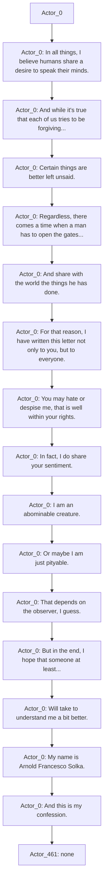

# Trachi/West/Farblein Trail/Farblein Apartments/First floor/Solka Backroom/Tanner

```mermaid
graph TD
    703_0["Actor_0"]
    703_1["Actor_0: In all things, I believe humans share a desire to speak their minds."]
    703_2["Actor_0: And while it's true that each of us tries to be forgiving..."]
    703_3["Actor_0: Certain things are better left unsaid."]
    703_4["Actor_0: Regardless, there comes a time when a man has to open the gates..."]
    703_5["Actor_0: And share with the world the things he has done."]
    703_6["Actor_0: For that reason, I have written this letter not only to you, but to everyone."]
    703_7["Actor_0: You may hate or despise me, that is well within your rights."]
    703_8["Actor_0: In fact, I do share your sentiment."]
    703_9["Actor_0: I am an abominable creature."]
    703_10["Actor_0: Or maybe I am just pityable."]
    703_11["Actor_0: That depends on the observer, I guess."]
    703_12["Actor_0: But in the end, I hope that someone at least..."]
    703_13["Actor_0: Will take to understand me a bit better."]
    703_14["Actor_0: My name is Arnold Francesco Solka."]
    703_15["Actor_0: And this is my confession."]
    703_16["Actor_461: none"]
    703_0 --> 703_1
    703_1 --> 703_2
    703_2 --> 703_3
    703_3 --> 703_4
    703_4 --> 703_5
    703_5 --> 703_6
    703_6 --> 703_7
    703_7 --> 703_8
    703_8 --> 703_9
    703_9 --> 703_10
    703_10 --> 703_11
    703_11 --> 703_12
    703_12 --> 703_13
    703_13 --> 703_14
    703_14 --> 703_15
    703_15 --> 703_16
```