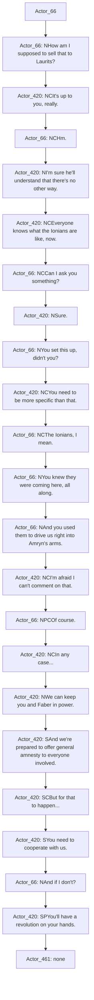

# Trachi/West/Farblein Trail/Farblein Apartments/First floor/Tanner Apartment/Tanner

```mermaid
graph TD
    704_0["Actor_66"]
    704_1["Actor_66: NHow am I supposed to sell that to Laurits?"]
    704_2["Actor_420: NCIt's up to you, really."]
    704_3["Actor_66: NCHm."]
    704_4["Actor_420: NI'm sure he'll understand that there's no other way."]
    704_5["Actor_420: NCEveryone knows what the Ionians are like, now."]
    704_6["Actor_66: NCCan I ask you something?"]
    704_7["Actor_420: NSure."]
    704_8["Actor_66: NYou set this up, didn't you?"]
    704_9["Actor_420: NCYou need to be more specific than that."]
    704_10["Actor_66: NCThe Ionians, I mean."]
    704_11["Actor_66: NYou knew they were coming here, all along."]
    704_12["Actor_66: NAnd you used them to drive us right into Amryn's arms."]
    704_13["Actor_420: NCI'm afraid I can't comment on that."]
    704_14["Actor_66: NPCOf course."]
    704_15["Actor_420: NCIn any case..."]
    704_16["Actor_420: NWe can keep you and Faber in power."]
    704_17["Actor_420: SAnd we're prepared to offer general amnesty to everyone involved."]
    704_18["Actor_420: SCBut for that to happen..."]
    704_19["Actor_420: SYou need to cooperate with us."]
    704_20["Actor_66: NAnd if I don't?"]
    704_21["Actor_420: SPYou'll have a revolution on your hands."]
    704_22["Actor_461: none"]
    704_0 --> 704_1
    704_1 --> 704_2
    704_2 --> 704_3
    704_3 --> 704_4
    704_4 --> 704_5
    704_5 --> 704_6
    704_6 --> 704_7
    704_7 --> 704_8
    704_8 --> 704_9
    704_9 --> 704_10
    704_10 --> 704_11
    704_11 --> 704_12
    704_12 --> 704_13
    704_13 --> 704_14
    704_14 --> 704_15
    704_15 --> 704_16
    704_16 --> 704_17
    704_17 --> 704_18
    704_18 --> 704_19
    704_19 --> 704_20
    704_20 --> 704_21
    704_21 --> 704_22
```