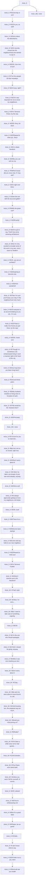

# Trachi/West/Filmore Avenue/EV011

```mermaid
graph TD
    705_0["Actor_6"]
    705_1["Actor_6: RSGood day to you!"]
    705_2["Actor_9: NGDTo you, as well!"]
    705_3["Actor_9: NSSorry about the disturbance."]
    705_4["Actor_9: NGDI recently moved into the neighbourhood and wanted to say hi."]
    705_5["Actor_6: NSDOh, how nice of you!"]
    705_6["Actor_6: RCToo few people do that nowadays."]
    705_7["Actor_9: NGDI know, right?"]
    705_8["Actor_9: NSCIt's very important for me to know my neighbours."]
    705_9["Actor_9: NSI'm Terrence Firaun, by the way."]
    705_10["Actor_9: NGDOr Terry, for short."]
    705_11["Actor_6: NSDPleased to meet you, Terry!"]
    705_12["Actor_6: NSI'm Liliane Hendrick."]
    705_13["Actor_6: NSDBut you can call me Lily."]
    705_14["Actor_6: RSWhich house did you move into, if I may ask?"]
    705_15["Actor_9: SSIt's right over there."]
    705_16["Actor_9: SSSee the one with the stuccoed gable?"]
    705_17["Actor_6: RSWith the green roof?"]
    705_18["Actor_9: NGDExactly!"]
    705_19["Actor_9: NGDI've got to say, Trachi has some amazing architecture."]
    705_20["Actor_9: SSSo I'm very excited to emulate some of the work in my own, once I return to Stratfurt."]
    705_21["Actor_6: REOh, you are an architect?"]
    705_22["Actor_9: NGDAspiring to become one."]
    705_23["Actor_6: NSDHow wonderful!"]
    705_24["Actor_6: RSThen I'm sure you'll enjoy your stay in this neighbourhood very much."]
    705_25["Actor_9: NSCIf everyone is as accommodating as you are, I'm sure."]
    705_26["Actor_9: NGDThat's a really nice house you got there, by the way!"]
    705_27["Actor_6: NSDOh, thank you!"]
    705_28["Actor_6: RCThough I'm sometimes a bit embarrassed living in such a mansion right in the heart of the city."]
    705_29["Actor_9: SSHow long have you been living here?"]
    705_30["Actor_6: RSAround three years."]
    705_31["Actor_6: NSDMy husband insisted on living close to his place of work."]
    705_32["Actor_9: SSThat would be Mr. Hendrick then?"]
    705_33["Actor_6: NSDPrecisely!"]
    705_34["Actor_461: none"]
    705_35["Actor_6: RCI'd love for you to meet him..."]
    705_36["Actor_6: RBut he's out on an errand, right now."]
    705_37["Actor_9: NGDDon't worry about it!"]
    705_38["Actor_9: SSI think I've taken up enough of your own time already, anyway."]
    705_39["Actor_6: NSDNot at all!"]
    705_40["Actor_6: RSI always appreciate getting to know my neighbours a bit better."]
    705_41["Actor_6: NSOh, look!"]
    705_42["Actor_6: NSDThere he is."]
    705_43["Actor_6: NSWelcome back, darling!"]
    705_44["Actor_6: NSCome and say hello to our new neighbour."]
    705_45["Actor_9: NGDPleased to meet you!"]
    705_46["Actor_9: SSI'm Terrence Fusilier."]
    705_47["Actor_9: NGDAnd I assume you're Mr. Hendrick?"]
    705_48["Actor_64: NThat's right."]
    705_49["Actor_64: NCNow, I'm sorry..."]
    705_50["Actor_64: NBut I need to take care of something, urgently."]
    705_51["Actor_9: NEOh!"]
    705_52["Actor_9: NCI'm the one who should apologize."]
    705_53["Actor_9: NSI think I should be going, anyway."]
    705_54["Actor_9: NGDBut it was nice meeting you two!"]
    705_55["Actor_64: NDon't worry about it."]
    705_56["Actor_64: NCSay..."]
    705_57["Actor_64: NMe and Lily were about to have brunch in a bit."]
    705_58["Actor_64: NCAnd knowing her, she prepared way too much."]
    705_59["Actor_64: SWould you mind joining us?"]
    705_60["Actor_6: RSReally?"]
    705_61["Actor_64: NCIt's been a while since we've had guests..."]
    705_62["Actor_64: NCAnd besides..."]
    705_63["Actor_64: NThe Chario won't drink itself."]
    705_64["Actor_64: NUnless you want it all for yourself, of course."]
    705_65["Actor_6: NSOh, please!"]
    705_66["Actor_6: NSDYou're embarassing me!"]
    705_67["Actor_6: NSBut it's a great idea!"]
    705_68["Actor_6: NSPlease, be our guest!"]
    705_69["Actor_9: RCWell..."]
    705_70["Actor_9: RI don't know what to say."]
    705_71["Actor_6: NSDI'll take it as a yes, then!"]
    705_72["Actor_6: NSAnd will see you inside!"]
    705_73["Actor_461: none"]
    705_0 --> 705_1
    705_0 --> 705_73
    705_1 --> 705_2
    705_2 --> 705_3
    705_3 --> 705_4
    705_4 --> 705_5
    705_5 --> 705_6
    705_6 --> 705_7
    705_7 --> 705_8
    705_8 --> 705_9
    705_9 --> 705_10
    705_10 --> 705_11
    705_11 --> 705_12
    705_12 --> 705_13
    705_13 --> 705_14
    705_14 --> 705_15
    705_15 --> 705_16
    705_16 --> 705_17
    705_17 --> 705_18
    705_18 --> 705_19
    705_19 --> 705_20
    705_20 --> 705_21
    705_21 --> 705_22
    705_22 --> 705_23
    705_23 --> 705_24
    705_24 --> 705_25
    705_25 --> 705_26
    705_26 --> 705_27
    705_27 --> 705_28
    705_28 --> 705_29
    705_29 --> 705_30
    705_30 --> 705_31
    705_31 --> 705_32
    705_32 --> 705_33
    705_33 --> 705_34
    705_34 --> 705_35
    705_35 --> 705_36
    705_36 --> 705_37
    705_37 --> 705_38
    705_38 --> 705_39
    705_39 --> 705_40
    705_40 --> 705_41
    705_41 --> 705_42
    705_42 --> 705_43
    705_43 --> 705_44
    705_44 --> 705_45
    705_45 --> 705_46
    705_46 --> 705_47
    705_47 --> 705_48
    705_48 --> 705_49
    705_49 --> 705_50
    705_50 --> 705_51
    705_51 --> 705_52
    705_52 --> 705_53
    705_53 --> 705_54
    705_54 --> 705_55
    705_55 --> 705_56
    705_56 --> 705_57
    705_57 --> 705_58
    705_58 --> 705_59
    705_59 --> 705_60
    705_60 --> 705_61
    705_61 --> 705_62
    705_62 --> 705_63
    705_63 --> 705_64
    705_64 --> 705_65
    705_65 --> 705_66
    705_66 --> 705_67
    705_67 --> 705_68
    705_68 --> 705_69
    705_69 --> 705_70
    705_70 --> 705_71
    705_71 --> 705_72
```