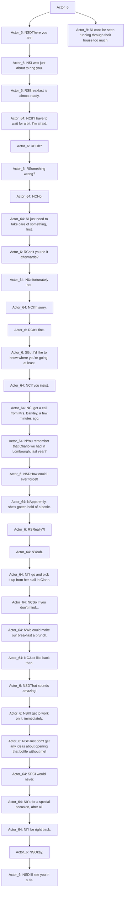

# Trachi/West/Filmore Avenue/Hendrick Villa/EV003

```mermaid
graph TD
    708_0["Actor_6"]
    708_1["Actor_6: NSDThere you are!"]
    708_2["Actor_6: NSI was just about to ring you."]
    708_3["Actor_6: RSBreakfast is almost ready."]
    708_4["Actor_64: NCIt'll have to wait for a bit, I'm afraid."]
    708_5["Actor_6: REOh?"]
    708_6["Actor_6: RSomething wrong?"]
    708_7["Actor_64: NCNo."]
    708_8["Actor_64: NI just need to take care of something, first."]
    708_9["Actor_6: RCan't you do it afterwards?"]
    708_10["Actor_64: NUnfortunately not."]
    708_11["Actor_64: NCI'm sorry."]
    708_12["Actor_6: RCIt's fine."]
    708_13["Actor_6: SBut I'd like to know where you're going, at least."]
    708_14["Actor_64: NCIf you insist."]
    708_15["Actor_64: NCI got a call from Mrs. Barkley, a few minutes ago."]
    708_16["Actor_64: NYou remember that Chario we had in Lombourgh, last year?"]
    708_17["Actor_6: NSDHow could I ever forget!"]
    708_18["Actor_64: NApparently, she's gotten hold of a bottle."]
    708_19["Actor_6: RSReally?!"]
    708_20["Actor_64: NYeah."]
    708_21["Actor_64: NI'll go and pick it up from her stall in Clarin."]
    708_22["Actor_64: NCSo if you don't mind..."]
    708_23["Actor_64: NWe could make our breakfast a brunch."]
    708_24["Actor_64: NCJust like back then."]
    708_25["Actor_6: NSDThat sounds amazing!"]
    708_26["Actor_6: NSI'll get to work on it, immediately."]
    708_27["Actor_6: NSDJust don't get any ideas about opening that bottle without me!"]
    708_28["Actor_64: SPCI would never."]
    708_29["Actor_64: NIt's for a special occasion, after all."]
    708_30["Actor_64: NI'll be right back."]
    708_31["Actor_6: NSOkay."]
    708_32["Actor_6: NSDI'll see you in a bit."]
    708_33["Actor_9: NI can't be seen running through their house too much."]
    708_0 --> 708_1
    708_0 --> 708_33
    708_1 --> 708_2
    708_2 --> 708_3
    708_3 --> 708_4
    708_4 --> 708_5
    708_5 --> 708_6
    708_6 --> 708_7
    708_7 --> 708_8
    708_8 --> 708_9
    708_9 --> 708_10
    708_10 --> 708_11
    708_11 --> 708_12
    708_12 --> 708_13
    708_13 --> 708_14
    708_14 --> 708_15
    708_15 --> 708_16
    708_16 --> 708_17
    708_17 --> 708_18
    708_18 --> 708_19
    708_19 --> 708_20
    708_20 --> 708_21
    708_21 --> 708_22
    708_22 --> 708_23
    708_23 --> 708_24
    708_24 --> 708_25
    708_25 --> 708_26
    708_26 --> 708_27
    708_27 --> 708_28
    708_28 --> 708_29
    708_29 --> 708_30
    708_30 --> 708_31
    708_31 --> 708_32
```