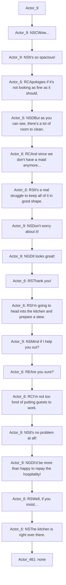

# Trachi/West/Filmore Avenue/Hendrick Villa/EV008

```mermaid
graph TD
    713_0["Actor_9"]
    713_1["Actor_9: NSCWow..."]
    713_2["Actor_9: NSIt's so spacious!"]
    713_3["Actor_6: RCApologies if it's not looking as fine as it should."]
    713_4["Actor_6: NSDBut as you can see, there's a lot of room to clean."]
    713_5["Actor_6: RCAnd since we don't have a maid anymore..."]
    713_6["Actor_6: RSIt's a real struggle to keep all of it in good shape."]
    713_7["Actor_9: NSDon't worry about it!"]
    713_8["Actor_9: NGDIt looks great!"]
    713_9["Actor_6: RSThank you!"]
    713_10["Actor_6: RSI'm going to head into the kitchen and prepare a stew."]
    713_11["Actor_9: NSMind if I help you out?"]
    713_12["Actor_6: REAre you sure?"]
    713_13["Actor_6: RCI'm not too fond of putting guests to work."]
    713_14["Actor_9: NSIt's no problem at all!"]
    713_15["Actor_9: NGDI'd be more than happy to repay the hospitality!"]
    713_16["Actor_6: RSWell, if you insist..."]
    713_17["Actor_6: NSThe kitchen is right over there."]
    713_18["Actor_461: none"]
    713_0 --> 713_1
    713_1 --> 713_2
    713_2 --> 713_3
    713_3 --> 713_4
    713_4 --> 713_5
    713_5 --> 713_6
    713_6 --> 713_7
    713_7 --> 713_8
    713_8 --> 713_9
    713_9 --> 713_10
    713_10 --> 713_11
    713_11 --> 713_12
    713_12 --> 713_13
    713_13 --> 713_14
    713_14 --> 713_15
    713_15 --> 713_16
    713_16 --> 713_17
    713_17 --> 713_18
```