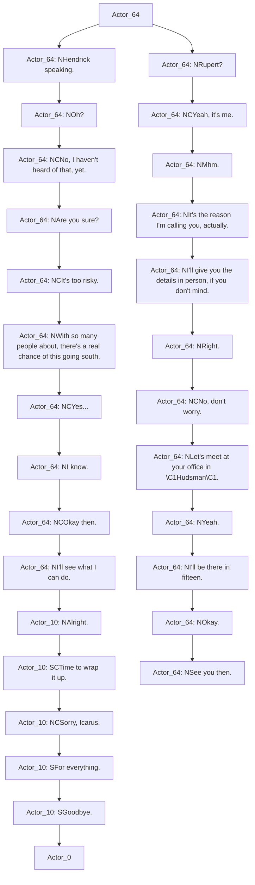

# Trachi/West/Filmore Avenue/Hendrick Villa/Hallway/Drenem Study/EV006

```mermaid
graph TD
    717_0["Actor_64"]
    717_1["Actor_64: NHendrick speaking."]
    717_2["Actor_64: NOh?"]
    717_3["Actor_64: NCNo, I haven't heard of that, yet."]
    717_4["Actor_64: NAre you sure?"]
    717_5["Actor_64: NCIt's too risky."]
    717_6["Actor_64: NWith so many people about, there's a real chance of this going south."]
    717_7["Actor_64: NCYes..."]
    717_8["Actor_64: NI know."]
    717_9["Actor_64: NCOkay then."]
    717_10["Actor_64: NI'll see what I can do."]
    717_11["Actor_10: NAlright."]
    717_12["Actor_10: SCTime to wrap it up."]
    717_13["Actor_10: NCSorry, Icarus."]
    717_14["Actor_10: SFor everything."]
    717_15["Actor_10: SGoodbye."]
    717_16["Actor_0"]
    717_17["Actor_64: NRupert?"]
    717_18["Actor_64: NCYeah, it's me."]
    717_19["Actor_64: NMhm."]
    717_20["Actor_64: NIt's the reason I'm calling you, actually."]
    717_21["Actor_64: NI'll give you the details in person, if you don't mind."]
    717_22["Actor_64: NRight."]
    717_23["Actor_64: NCNo, don't worry."]
    717_24["Actor_64: NLet's meet at your office in \C1Hudsman\C1."]
    717_25["Actor_64: NYeah."]
    717_26["Actor_64: NI'll be there in fifteen."]
    717_27["Actor_64: NOkay."]
    717_28["Actor_64: NSee you then."]
    717_0 --> 717_1
    717_0 --> 717_17
    717_1 --> 717_2
    717_2 --> 717_3
    717_3 --> 717_4
    717_4 --> 717_5
    717_5 --> 717_6
    717_6 --> 717_7
    717_7 --> 717_8
    717_8 --> 717_9
    717_9 --> 717_10
    717_10 --> 717_11
    717_11 --> 717_12
    717_12 --> 717_13
    717_13 --> 717_14
    717_14 --> 717_15
    717_15 --> 717_16
    717_17 --> 717_18
    717_18 --> 717_19
    717_19 --> 717_20
    717_20 --> 717_21
    717_21 --> 717_22
    717_22 --> 717_23
    717_23 --> 717_24
    717_24 --> 717_25
    717_25 --> 717_26
    717_26 --> 717_27
    717_27 --> 717_28
```