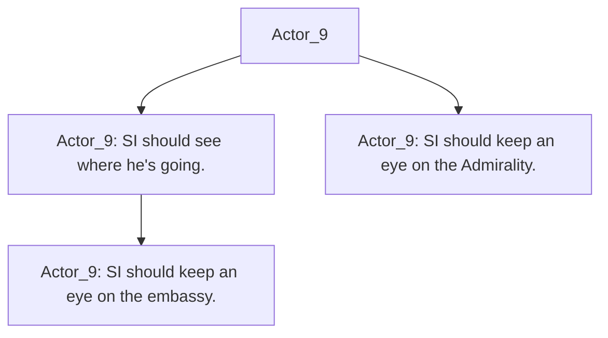

# Trachi/West/Gharten Street/EV016

```mermaid
graph TD
    719_0["Actor_9"]
    719_1["Actor_9: SI should see where he's going."]
    719_2["Actor_9: SI should keep an eye on the embassy."]
    719_3["Actor_9: SI should keep an eye on the Admirality."]
    719_0 --> 719_1
    719_0 --> 719_3
    719_1 --> 719_2
```