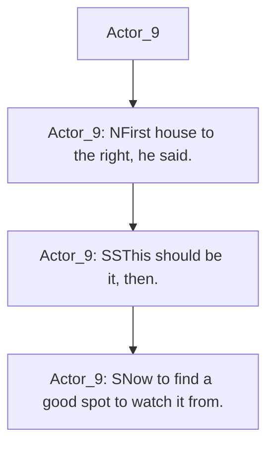

# Trachi/West/Gharten Street/EV018

```mermaid
graph TD
    721_0["Actor_9"]
    721_1["Actor_9: NFirst house to the right, he said."]
    721_2["Actor_9: SSThis should be it, then."]
    721_3["Actor_9: SNow to find a good spot to watch it from."]
    721_0 --> 721_1
    721_1 --> 721_2
    721_2 --> 721_3
```