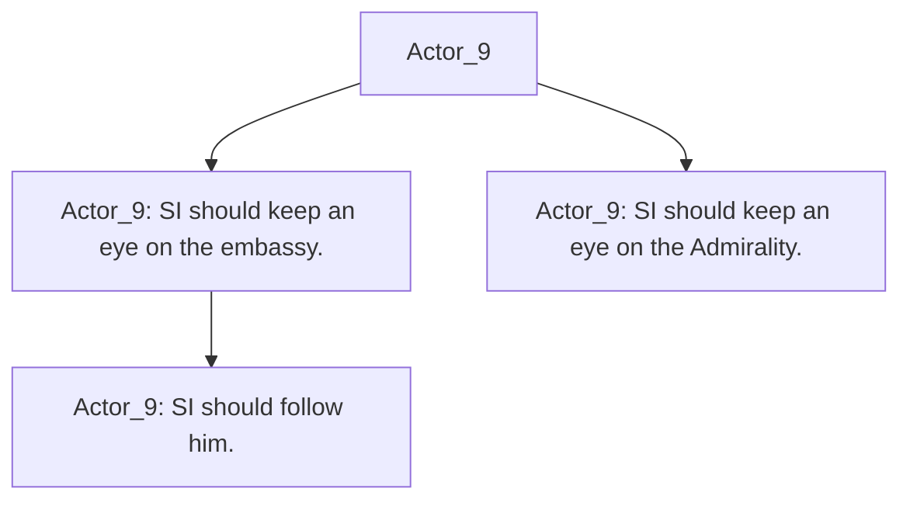

# Trachi/West/Gharten Street/EV033

```mermaid
graph TD
    724_0["Actor_9"]
    724_1["Actor_9: SI should keep an eye on the embassy."]
    724_2["Actor_9: SI should follow him."]
    724_3["Actor_9: SI should keep an eye on the Admirality."]
    724_0 --> 724_1
    724_0 --> 724_3
    724_1 --> 724_2
```