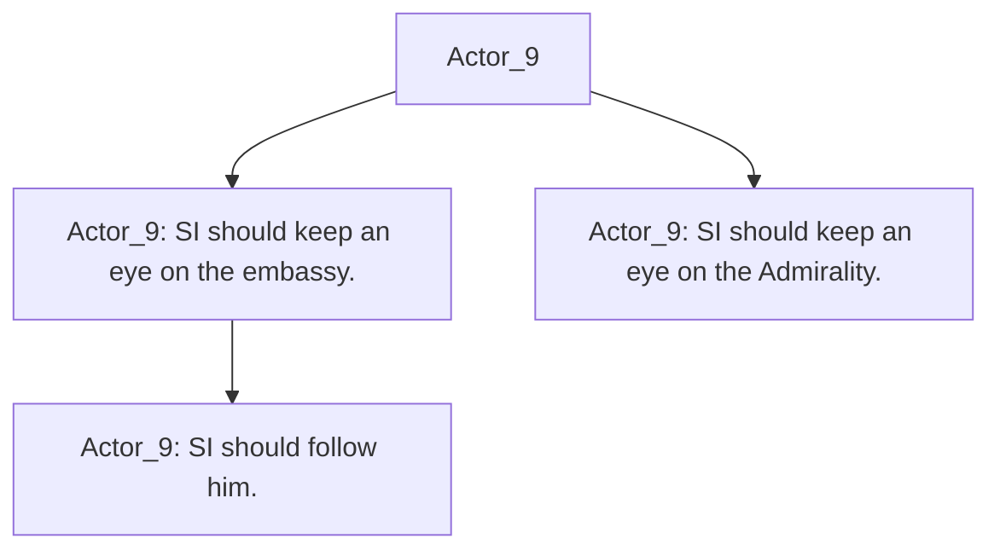

# Trachi/West/Gharten Street/EV035

```mermaid
graph TD
    726_0["Actor_9"]
    726_1["Actor_9: SI should keep an eye on the embassy."]
    726_2["Actor_9: SI should follow him."]
    726_3["Actor_9: SI should keep an eye on the Admirality."]
    726_0 --> 726_1
    726_0 --> 726_3
    726_1 --> 726_2
```